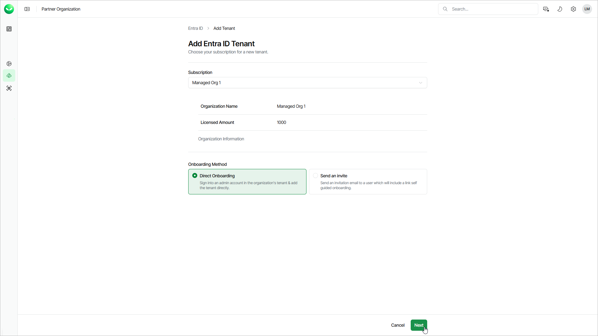

# Step 1. Launch Add Entra ID Tenant Wizard

To launch the Add Entra ID tenant wizard, do the following:

1. To open the list of Entra ID tenants, click Entra ID on the left.
2. Click Add Tenant.
3. On the Add Entra ID Tenant page, from the Subscription drop-down list, select a subscription of the customer for which you want to create a tenant.

If the necessary subscription is not in the list, request a new subscription in VCSP Pulse. For details, see [Requesting Subscriptions](sp_subscriptions_request.md).

1. Select Direct Onboarding.
2. Click Next. Veeam Data Cloud will launch the Add Entra ID tenant wizard.

