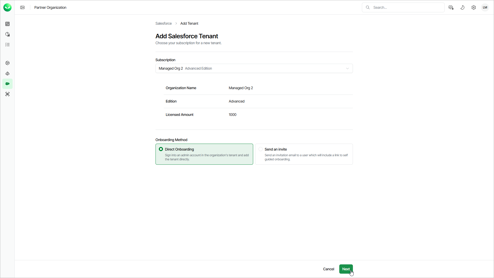

# Step 1. Launch Add Salesforce Tenant Wizard

To launch the Add Salesforce tenant wizard, do the following:

1. To open the list of Salesforce tenants, click Salesforce on the left.
2. Click Add Tenant.
3. On the Add Salesforce Tenant page, from the Subscription drop-down list, select a subscription of the customer for which you want to create a tenant.

If the necessary subscription is not in the list, request a new subscription in VCSP Pulse. For details, see [Requesting Subscriptions](sp_subscriptions_request.md).

1. Select Direct Onboarding.
2. Click Next. Veeam Data Cloud will launch the Add Salesforce Tenant wizard.

|  |
| --- |
| Tip |
| If you add a sandbox Salesforce tenant that was previously backed up with Veeam Data Cloud and later refreshed in Salesforce, the existing backup is deleted and the tenant is added as new. To keep the existing backup and only refresh the connection token for the sandbox tenant, [submit a support case](https://my.veeam.com/my-cases). |

