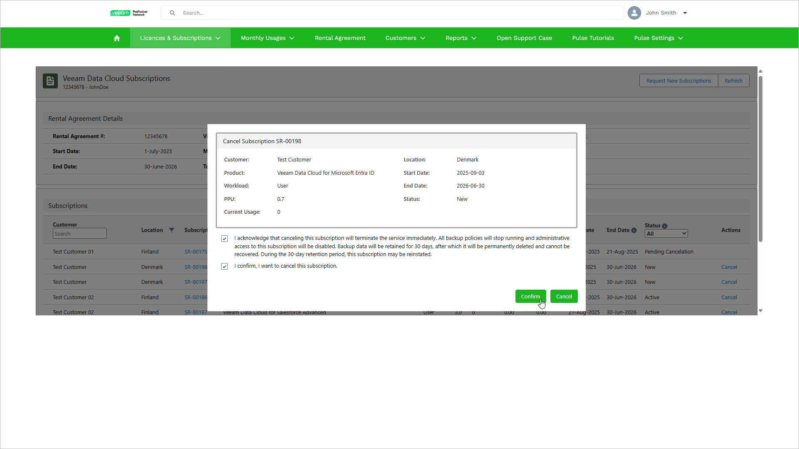

# Canceling Subscriptions

If you requested a subscription incorrectly, your customer no longer wants to protect a specific workload with Veeam Data Cloud, or you need to request a new subscription for the same product type, you can cancel the subscription. After you cancel the subscription, Veeam Data Cloud can provide a grace period depending on the subscription status:

* Subscriptions with the Active or Pending Reinstatement status will be suspended for 30 days. You can reinstate the suspended subscription during this period. After 30 days the subscription will be canceled.

During the grace period the backup policies in the tenants of your customer will be disabled.

* Subscriptions with the New or Pending Provisioning status will be canceled immediately.

To cancel a subscription, take the following steps:

1. Log in to VCSP Pulse. To do this, on [the ProPartner portal](https://propartner.veeam.com/), go to Manage My Business > VCSP Pulse and click Login to VCSP Pulse.
2. In VCSP Pulse, click Licences & Subscriptions > Veeam Data Cloud Subscriptions.
3. In the subscription list, click Cancel next to the subscription you want to cancel. You can cancel subscriptions with the New, Pending Provisioning, Active or Pending Reinstatement status.
4. In the Cancel Subscription window, select both check boxes to acknowledge the grace period and confirm the cancelation.
5. Click Confirm.

