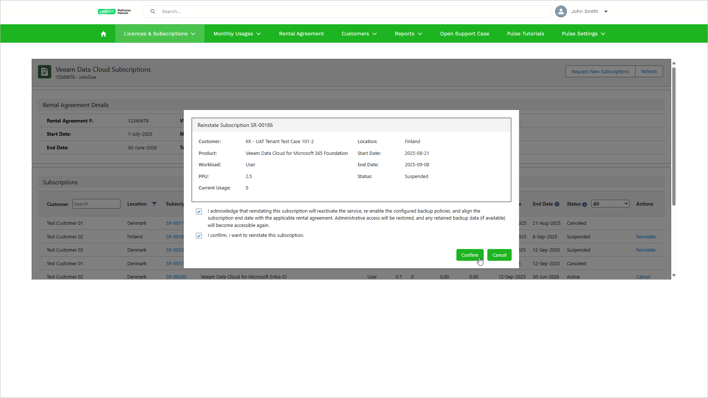

# Reinstating Subscription

If you cancel a subscription by mistake, or your customer wants to resume using a specific Veeam Data Cloud product, you can reinstate the suspended subscription during the grace period. After you reinstate the subscription, Veeam Data Cloud will enable the backup policies of your customer.

|  |
| --- |
| Note |
| If you request a new subscription with the same product type as the terminated subscription, the terminated subscription cannot be reinstated. |

To reinstate a subscription, take the following steps:

1. Log in to VCSP Pulse. To do this, on [the ProPartner portal](https://propartner.veeam.com/), go to Manage My Business > VCSP Pulse and click Login to VCSP Pulse.
2. In VCSP Pulse, click Licences & Subscriptions > Veeam Data Cloud Subscriptions.
3. In the subscription list, click Reinstate next to the subscription you want to reinstate. You can reinstate subscriptions with the Terminated status.
4. In the Reinstate Subscription window, select both check boxes to acknowledge the required changes and confirm the reinstatement.
5. Click Confirm.

