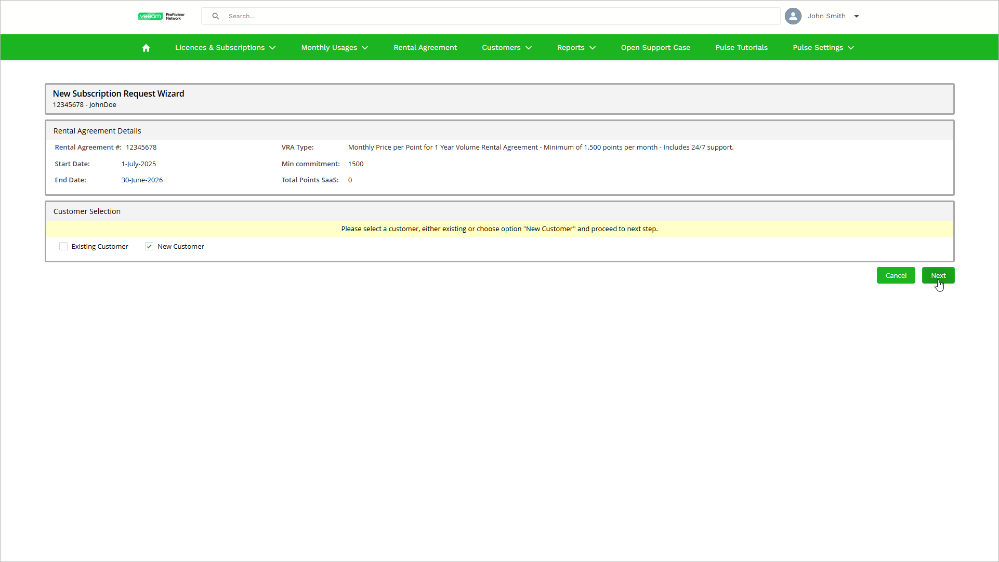

# Step 2. Specify Customer

At the Customer Selection step of the wizard, choose whether you want to request a subscription for a new or existing customer:

* To request subscriptions for an existing customer, select Existing Customer and then select the customer from the list.
* To request subscriptions for a new customer, select New Customer. You will specify the customer details in the next step.
* If you have no existing customers, the New Customer option will be selected automatically and the Existing Customer option will be disabled.

