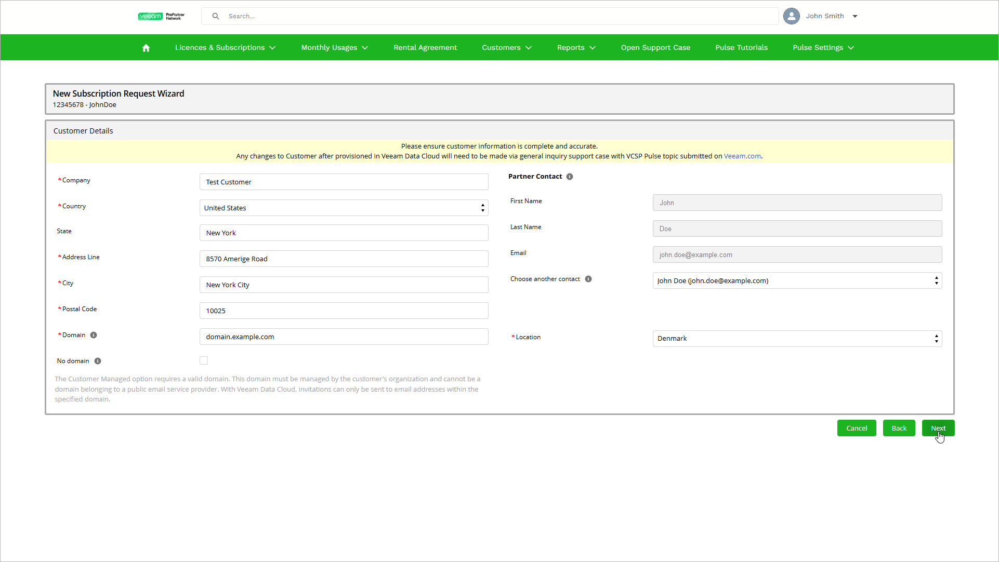

# Step 3. Specify Customer Details

At the Customer Details step of the wizard, do the following:

1. Specify the customer details.

* For a verified customer, review the details. Field values in this section are populated automatically from the customer database.
* For a new or non-verified customer, enter the missing details. The required fields are marked with asterisk (\*).
* If you plan to provide the customer access to Veeam Data Cloud, in the Domain field, specify a valid domain. This domain must be managed by the customer organization and cannot be a public email service provider domain. Veeam Data Cloud sends invitations only to email addresses within the specified domain.

1. In the Partner Contact section, specify a contact that has either a Veeam My Account or a Microsoft 365 account (UPN account, not an alias or group address). Veeam Data Cloud will assign the selected contact the OrganizationAdmin role in your Veeam Data Cloud organization. You can then use the specified contact account to log in to the Veeam Data Cloud organization. For details, see [Accessing Veeam Data Cloud](accessing_vdc.md).
2. If you are a partner onboarded to site reporting, select a location from the Location drop-down list:

* For primary license administrators, the list includes all active locations.
* For site license administrators, the list includes the locations to which the employee is assigned as a license administrator. If the employee is assigned only to one location, the Location field is automatically populated with this active location.

For details on site reporting, see the [Using VCSP Pulse](https://helpcenter.veeam.com/docs/vcsp/refguide/using_vcsp_pulse.html#site-reporting) section of the Veeam Rental Licensing and Usage Reporting Reference Guide.

