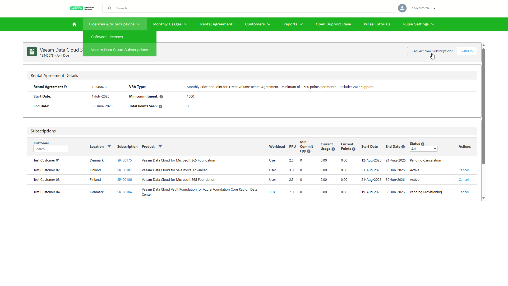

# Step 1. Launch New Subscription Request Wizard

To launch the New Subscription Request wizard, do the following:

1. Log in to VCSP Pulse. To do this, on [the ProPartner portal](https://propartner.veeam.com/), go to Manage My Business > VCSP Pulse and click Login to VCSP Pulse.
2. In VCSP Pulse, click Licences & Subscriptions > Veeam Data Cloud Subscriptions.
3. Click Request New Subscriptions.

