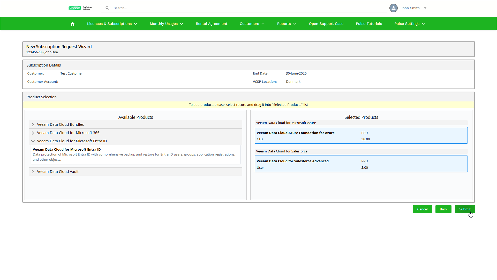

# Step 4. Specify Subscription Products

At the Product Selection step of the wizard, add subscription products and bundles that you want to include in the new subscription request. If the customer has an active subscription for a specific licensing product, you cannot request another subscription for that product or a subscription bundle that includes the same product. To request a new subscription for a product, cancel the customer active subscription with the same product first. For details, see [Canceling Subscriptions](sp_subscriptions_cancel.md).

To add a product, drag it from the Available Products field to the Selected Products field. After you add the products, click Submit.

