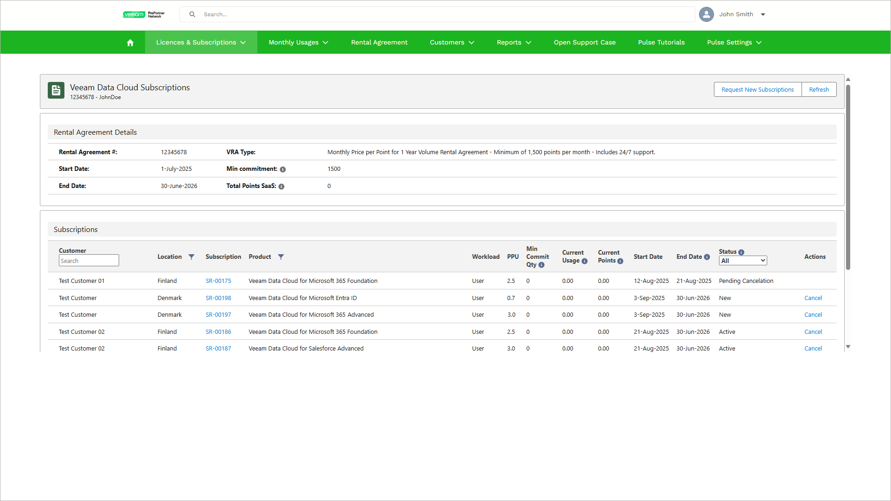

# Viewing Subscriptions

In VCSP Pulse, you can view details about your rental agreement and all subscriptions assigned to your customers.

To view subscriptions, take the following steps:

1. Log in to VCSP Pulse. To do this, on [the ProPartner portal](https://propartner.veeam.com/), go to Manage My Business > VCSP Pulse and click Login to VCSP Pulse.
2. In VCSP Pulse, click Licences & Subscriptions > Veeam Data Cloud Subscriptions.

In the Rental Agreement Details section you can review the following information:

* Rental agreement number and type.
* Start and end date of your rental agreement.
* Minimal commitment of purchased points per month.
* Current number of points for Veeam Data Cloud subscriptions. This number is the sum of current points per subscription.

Subscription Properties

In the Subscriptions section, VCSP Pulse displays the following properties for each subscription:

| Property | Description |
| --- | --- |
| Customer | Name of the customer to which the subscription is assigned. |
| Location | Location for site reporting. For details on site reporting, see the [Using VCSP Pulse](https://helpcenter.veeam.com/docs/vcsp/refguide/using_vcsp_pulse.html#site-reporting) section of the Veeam Rental Licensing and Usage Reporting Reference Guide. |
| Subscription | Subscription request ID. |
| Product | Subscription product. |
| Workload | Licensed unit that is used for the subscription. For details, see [License Consumption](saas_license_consumption.md). |
| PPU | Points per unit. For details, see [License Consumption](saas_license_consumption.md). |
| Min Commit Qty | Minimum commitment quantity that represents the minimum number of licensed units that you commit to be consumed by your customer each month.   * If you use standard PPU for this subscription, the minimum commitment quantity value is set to 0. * If you use lower PPU for this subscription, the minimum commitment quantity applies. For details, see [Rental Agreements and Licensing Terms](saas_rental_agreement_terms.md). |
| Current Usage | The highest level of daily consumption of licensed units recorded during the current month. The last day usage is compared to the current usage value, and the value is updated if a new peak is reached. |
| Current Points | Current points are calculated by multiplying the PPU by a quantity. This quantity is whichever is greater — the minimum commitment or the current usage. For example if your minimum commitment is 1000 units and the current usage is 500 units, VCSP Pulse will use the minimum commitment for the calculation of the current points value. |
| Start Date | Date when you requested the subscription. |
| End Date | Subscription end date that is aligned with rental agreement end date. For canceled or suspended subscriptions it is the date of submitted cancelation. |
| Status | Current state of the subscription. For details, see [Subscription Statuses](#statuses). |

Subscription Statuses

Each subscription can have one of the following statuses:

| Status | Description |
| --- | --- |
| New | The subscription request has been submitted. |
| Pending Provisioning | The subscription is ready to be provisioned in Veeam Data Cloud. |
| Active | The subscription is provisioned in Veeam Data Cloud and you can onboard your customer. For details on onboarding, see [Onboarding Customers](sp_customers_onboard.md). |
| Pending Cancellation | The cancellation request for the subscription has been submitted. For details on canceling subscriptions, see [Canceling Subscriptions](sp_subscriptions_cancel.md). |
| Terminated | Your cancellation request has been accepted and the subscription is suspended for 30 days. You can reinstate the terminated subscription during this period. After 30 days the subscription will be canceled. For details on reinstating subscriptions, see [Reinstating Subscription](sp_subscriptions_reinstate.md). |
| Pending Reinstatement | You have requested a reinstatement of the canceled subscription within the grace period. |
| Canceled | Your cancellation request is completed and the subscription ended. |
| Duplicate Customer | The customer is linked to an end customer account that has a subscription for the same product. VCSP Pulse links unverified customers end customer accounts during the verification process. |

