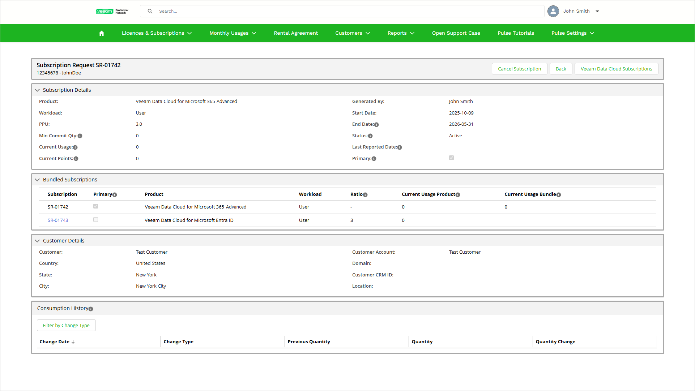

# Viewing Subscription Details

In VCSP Pulse, you can view details of a specific subscription that is assigned to your customer.

To view the subscription details, take the following steps:

1. Log in to VCSP Pulse. To do this, on [the ProPartner portal](https://propartner.veeam.com/), go to Manage My Business > VCSP Pulse and click Login to VCSP Pulse.
2. To open the list of subscriptions, click Licences & Subscriptions > Veeam Data Cloud Subscriptions.
3. Click the ID of the subscription you want to view.

The Subscription Request page is divided into several sections that contain detailed information on subscription properties, the assigned customer and consumption history.

* The Subscriptions Details section displays the properties of the subscription. For more information on subscription properties, see [Viewing Subscriptions](sp_subscriptions_view.md).
* Veeam Data Cloud bundles combine multiple products into a subscription package. One product is designated as the primary, and its PPU rate applies to the entire bundle. License consumption from other products is converted to the primary product consumption using predefined ratios. If the subscription is a bundle, in the Bundled Subscriptions section, you can view all subscriptions included in the bundle with the following properties for each subscription:

| Property | Description |
| --- | --- |
| Subscription | Subscription ID. |
| Primary | Check box that indicates the primary subscription within the bundle. Usage of all bundled subscriptions is allocated only to the primary subscription. |
| Product | Subscription product. |
| Workload | Licensed unit that is used for the subscription. For details, see [License Consumption](saas_license_consumption.md). |
| Ratio | Conversion ratio that is used to allocate the subscription usage to the primary subscription of the bundle. For example, if the ratio is 3 and the current usage for this subscription is 60 licensed units, VCSP Pulse will add 20 licensed units to the current bundle usage of the primary bundle subscription. |
| Current Usage Product | Highest daily consumption of licensed units recorded during the current month for this subscription. The last day usage is compared to the current usage value, and the value is updated if a new peak is reached. |
| Current Usage Bundle | Cumulative current usage that is displayed only for the primary subscription of the bundle. VCSP Pulse uses a conversion ratio to add current usage from other subscriptions that are included in the bundle. |

* The Customer Details section displays information about the customer assigned to this subscription.
* The Consumption History section shows license consumption changes for each product type that is included in this subscription or bundle.

