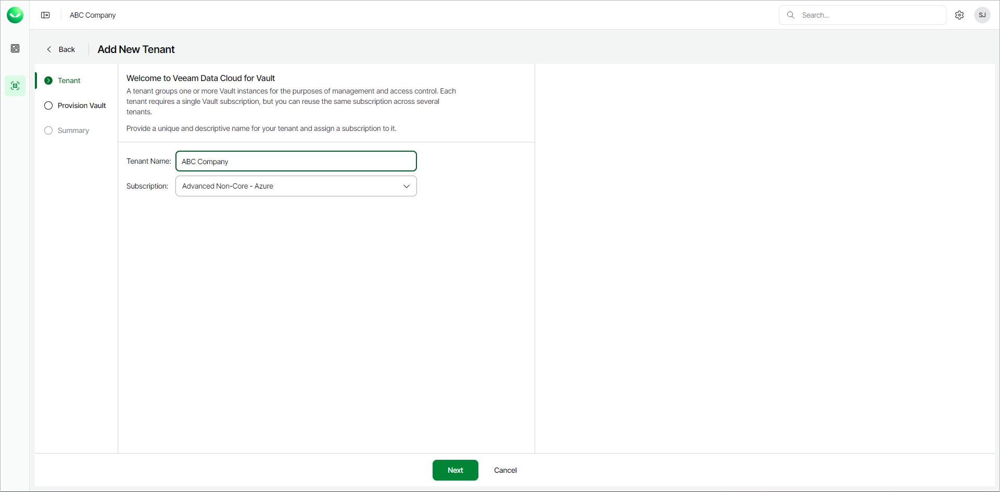
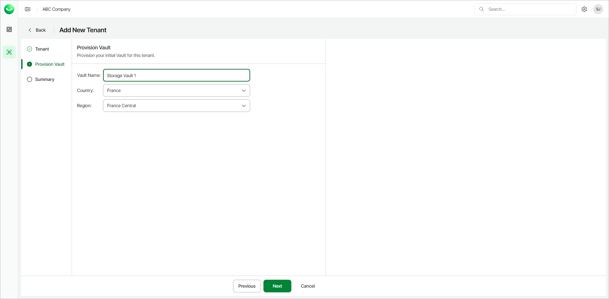
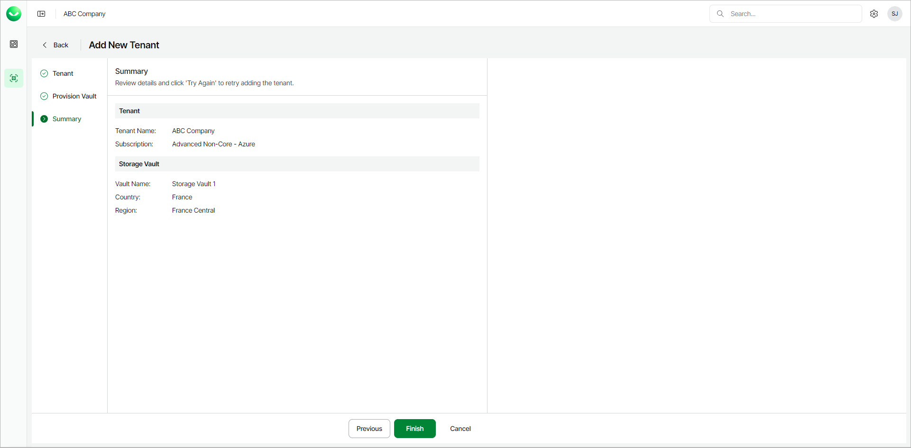
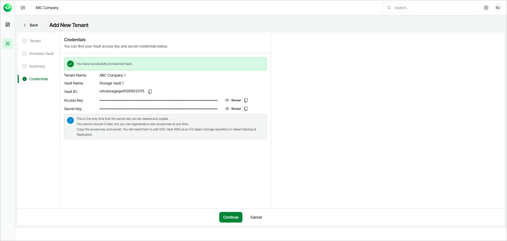

# Adding Veeam Data Cloud Vault Tenants

To add a Veeam Data Cloud Vault tenant, do the following:

1. Launch the Add New Tenant wizard:

1. To open the list of Vault tenants, click Vault on the left.
2. Click Add Tenant.
3. On the Add Vault Tenant page, from the Subscription drop-down list, select your subscription or a subscription of the customer for which you want to create a tenant.

If the necessary subscription is not in the list, request a new subscription in VCSP Pulse. For details, see [Requesting Subscriptions](sp_subscriptions_request.md).

1. Select Direct Onboarding.
2. Click Next. Veeam Data Cloud will launch the Add New Tenant wizard.

1. On the Add New Tenant page, at the Tenant step of the procedure, do the following:

1. In the Tenant Name field, specify a name for the new tenant.
2. From the Subscription drop-down list, select a Veeam Data Cloud Vault subscription.
3. [For the Advanced Core and Advanced Non-Core editions] From the Region drop-down list, select your preferred storage region. This helps you specify location for your data more precisely in case multiple datacenters in different regions are available within the country that you selected.
4. Click Next to continue.

1. At the Provision Vault step, do the following:

1. In the Vault Name field, specify the name of the new storage vault.
2. From the Country drop-down list, select the country where you want to create the new storage vault.
3. Click Next to continue.

1. At the Summary step, review details of the created tenant and click Finish. Veeam Data Cloud Vault will create the tenant and storage vault.

1. [For AWS editions] At the Credentials step of the wizard, Veeam Data Cloud Vault will display the access key and secret key required to access the storage vault. You can use these keys to add Veeam Data Cloud Vault as an object storage repository in Veeam Backup & Replication.

Copy the access key and storage key and save them for future use. Once you finish working with the Add New Tenant wizard, you will not be able to view and copy the secret key, and will need to regenerate it, if necessary.

1. To view the keys, click Reveal next to the values in the Access Key and Secret Key fields.
2. To copy the keys, click the copy icon next to the values in the Access Key and Secret Key fields.

1. Click Continue to return to the Vault page.

