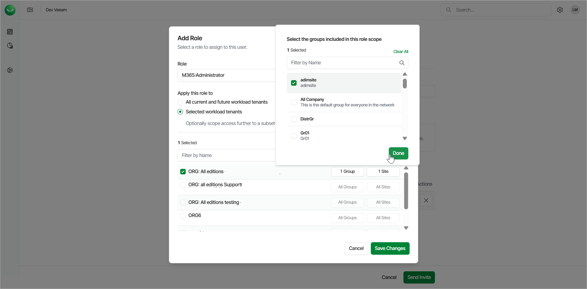
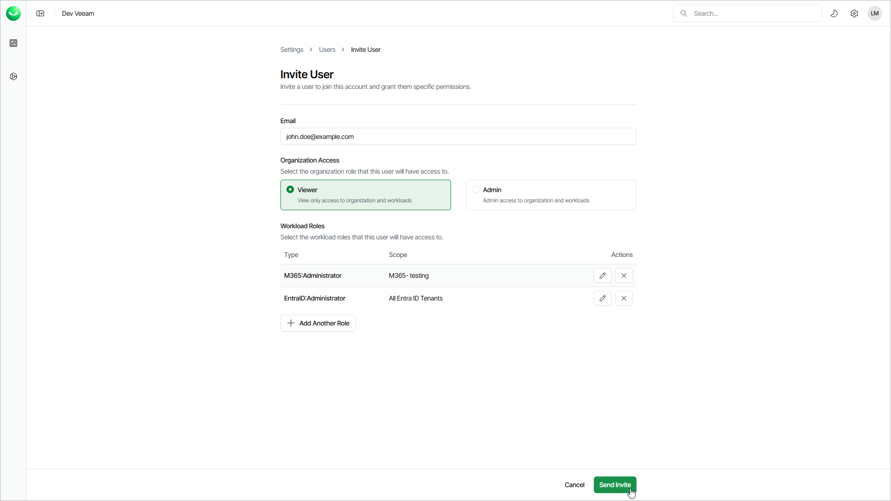

# Adding Users

Veeam Data Cloud allows you to add users, assign roles to them, and specify a role scope that defines which tenants the user can access. When you add a user to your Veeam Data Cloud organization, the user will receive an email with an invitation link.

User roles define the operations that the user can perform, including backup, restore and user management. You can assign a role with access to your entire Veeam Data Cloud organization or a specific workload, such as Microsoft Entra ID, Salesforce or Microsoft 365. Role scopes define tenants that the user can access, which can be helpful in larger organizations with multiple tenants where users are assigned to manage specific tenants.

|  |
| --- |
| Note |
| If you have users with scoped roles, manually update the role scopes after adding a new tenant to ensure the necessary users can access the new tenant. |

To add a user, follow these steps:

1. Click the settings icon in the top-right corner.
2. Select Users.
3. On the Users tab, click Invite User.
4. In the Invite User window, specify the following user details:

1. In the Email field, enter a Microsoft 365 email address of the user.

|  |
| --- |
| IMPORTANT |
| The user accounts that you add to Veeam Data Cloud must be UPN (User Principal Name) accounts from the same domain you use in your Veeam Data Cloud organization. If you want to add external users, create UPN accounts for them on your domain. You must not use alias addresses. For more information on UPN, see [this Microsoft article](https://learn.microsoft.com/en-us/entra/identity/hybrid/connect/plan-connect-userprincipalname). |

1. In the Organization Access section, select Viewer to assign the user the OrganizationViewer role or select Admin to assign the user the OrganizationAdmin role. Note that at least one organization-level role must be assigned to the user.

* If you select Viewer, you can assign additional roles to allow the user to work with workload tenants.
* If you select Admin, you cannot assign additional roles. This role grants access to all workloads and tenants. The user can manage users and perform all configuration actions, backup and restore operations.

1. If you selected Viewer, click Add Role to assign a role that allows the user to work with tenants.
2. In the Add Role window, do the following:

1. From the Role drop-down list, select a role you want to assign to the user.
2. Specify a role scope.

You can apply the role to all current and future workload tenants or select tenants to which the selected role will be applied. For details on role access rights, see [Roles](users_roles.md).

1. For the selected workload tenants scope, you can choose groups of users and SharePoint sites to include in the role scope.

This feature is currently only available for Microsoft 365 workloads.

1. Click Save Changes.
2. If you want to assign another role, click Add Another Role. You can also edit user roles later. For details, see [Editing Users](users_edit.md).

1. To complete the process and send the user an invitation link, click Send Invite.

