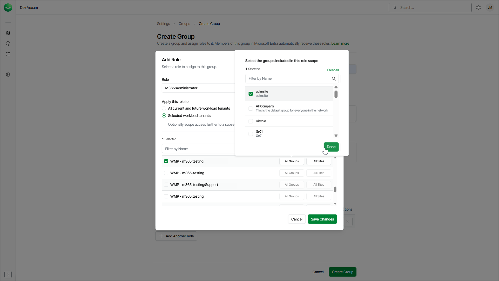
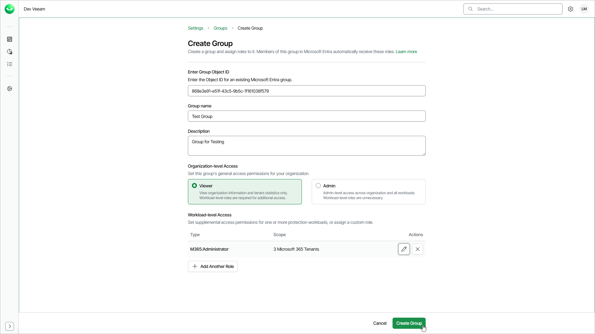

# Creating Groups

To create a group, follow these steps:

1. Click the settings icon in the top-right corner.
2. Select Groups.
3. On the Groups tab, click Create Group.
4. In the Create Group window, specify the following group details:

1. In the Group ID field, specify the object ID of the Microsoft Entra ID group you want to use to manage group membership.

The object ID must exactly match the object ID of the group in your Microsoft Entra ID organization that you use for single sign-on (SSO) with Veeam Data Cloud. For details, see [Groups](users_groups.md).

1. In the Group name field, enter a name for the group.
2. In the Description field, enter a description for your reference.
3. In the Organization Access section, select Viewer to assign the group the OrganizationViewer role or select Admin to assign the group the OrganizationAdmin role. Note that at least one organization-level role must be assigned to the group.

* If you select Viewer, you can assign additional roles to allow the group members to work with workload tenants.
* If you select Admin, you cannot assign additional roles. This role grants access to all workloads and tenants. The group members can manage users and perform all configuration actions, backup and restore operations.

1. If you selected Viewer, click Add Role to assign a role that allows the group members to work with tenants.
2. In the Add Role window, do the following:

1. From the Role drop-down list, select a role you want to assign to the group.
2. Specify a role scope.

You can apply the role to all current and future workload tenants or select tenants to which the selected role will be applied. For details on role access rights, see [Roles](users_roles.md).

1. For the selected workload tenants scope, you can choose groups of users and SharePoint sites to include in the role scope.

This feature is currently only available for Microsoft 365 workloads.

1. Click Save Changes.
2. If you want to assign another role, click Add Another Role. You can also edit group roles later. For details, see [Editing Groups](users_groups_edit.md).

1. To complete the process, click Create Group.

