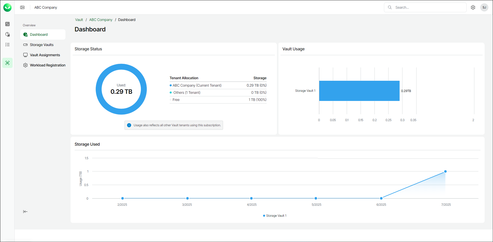

# Viewing Dashboard

Veeam Data Cloud Vault dashboard contains built-in widgets that provide aggregated data on the state of tenant storage vaults.

The data on the dashboard is updated once every 24 hours.

Storage amount is specified in TB (TB is considered as 2^40 bytes).

To view the Veeam Data Cloud Vault dashboard do the following:

1. On the Vault page, find the necessary tenant in the list of tenants. Click the button with three dots at the end of the row, then click Manage.
2. On the Dashboard page, view the following widgets:

* The Storage Status widget provides information about the storage usage within the subscription. The widget contains the following elements:

* The Tenant Allocation column that lists tenant names.
* The Storage counter shows the total amount of storage obtained by each tenant.
* A graph that represents the amount of used and free storage capacity.

* The Vault Usage widget.
* The Storage Used widget provides information about the total amount of storage used by each storage vault for the last 6 months. To view storage usage details for a specific month for a specific storage vault, move the cursor to a specific location on the graph.

|  |
| --- |
| Tip |
| You can view individual graphs for each storage vault. To learn more, see [Viewing Storage Vault Details](vault_storage_vaults_edit.md#view_vault). |

