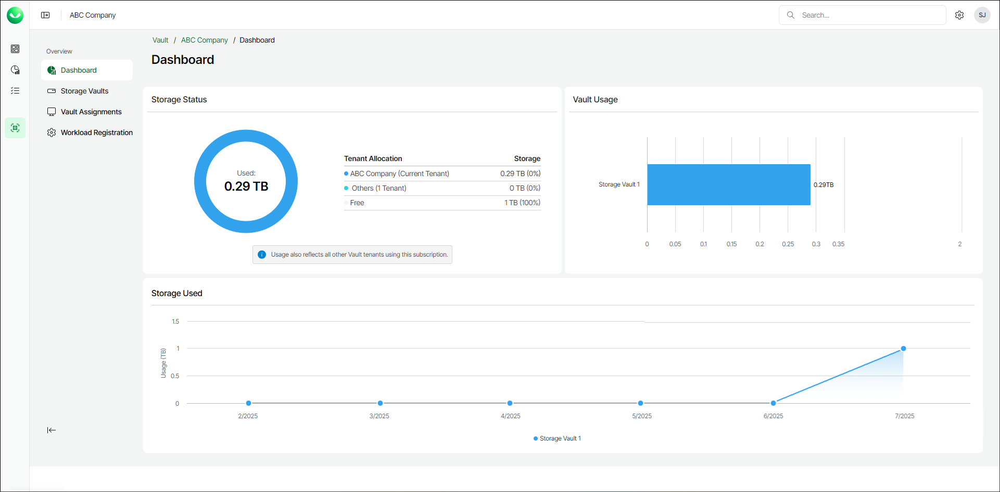

# Viewing Dashboard

Veeam Data Cloud Vault dashboard contains built-in widgets that provide aggregated data on the state of tenant storage vaults.

The data on the dashboard is updated once every 24 hours.

Storage amount is specified in TB (TB is considered as 2^40 bytes).

To view the Veeam Data Cloud Vault dashboard do the following:

1. On the Vault page, find the necessary tenant in the list of tenants. Click the menu icon at the end of the row, then click Manage.
2. On the Dashboard page, view the following widgets:

* The Storage Status widget provides information about the storage usage within the subscription. The widget contains the following elements:

* The Tenant Allocation column that lists tenant names.
* The Storage counter shows the total amount of storage obtained by each tenant.
* A graph that represents the amount of used and free storage capacity.

* The storage usage and storage egress widget. The widget contains the following counters:

* The Storage Usage counter shows the total storage capacity used by each storage vault over the past 6 months.
* The Storage Egress counter shows the total amount of data transferred out from each storage vault over the past 6 months.

* The Storage Used widget provides information about the total storage capacity used by each storage vault over the past 6 months. To view storage usage details for a specific month for a specific storage vault, move the cursor to a specific location on the graph.
* The Storage Egress widget provides information about the total amount of data transferred out from each storage vault over the past 6 months. To view storage usage details for a specific month for a specific storage vault, move the cursor to a specific location on the graph.

|  |
| --- |
| Tip |
| You can view individual graphs for each storage vault. To learn more, see [Viewing Storage Vault Details](vault_storage_vaults_edit.md#view_vault). |

