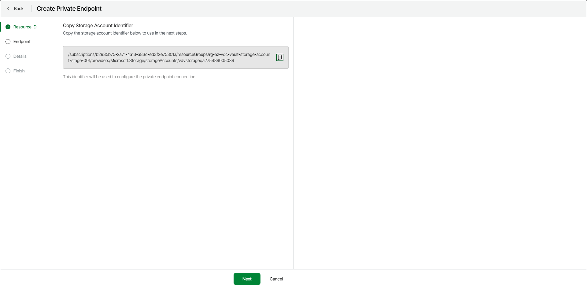

# Step 2. Copy Resource ID

At the Resource ID step of the wizard, click the copy icon next to the storage account identifier to copy the storage ID.

You will use the identifier in the next step to create the private endpoint resource.

