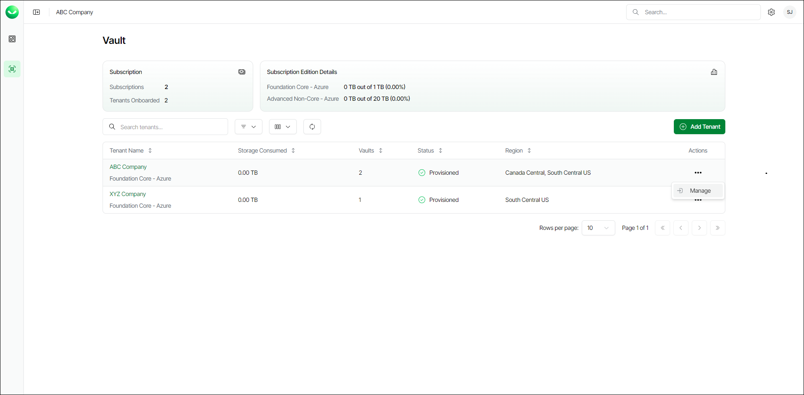

# Accessing Tenant Dashboard

To access the tenant dashboard, do the following:

1. On the Vault page, find the necessary tenant in the list of tenants.
2. Click the button with three dots at the end of the row, then click Manage. The dashboard page will open and you will be able to work with tenant resources. To learn more, see [Viewing Dashboard](vault_dashboard.md) and [Working with Storage Vaults](vault_storage_vaults.md).

