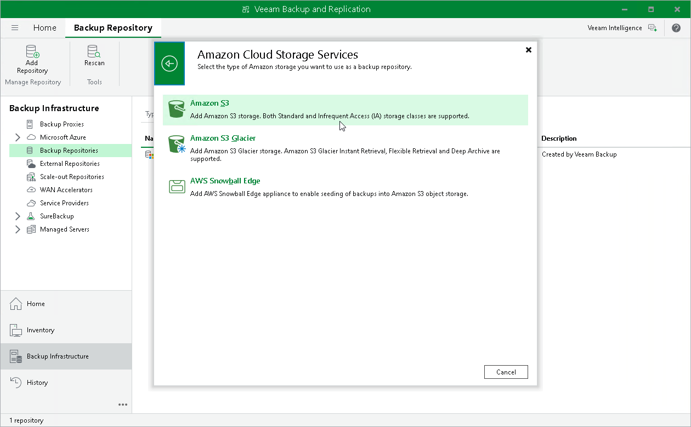
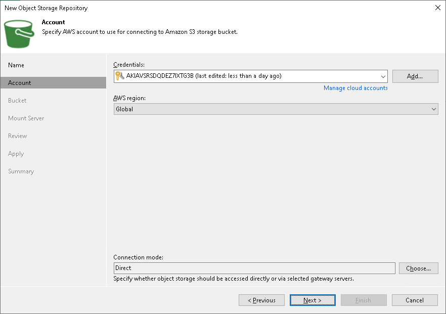
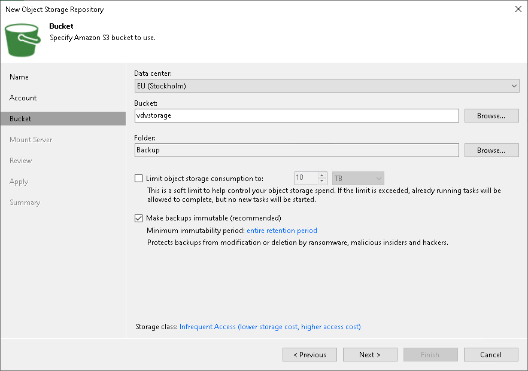

# Adding AWS Edition Storage Vaults in Veeam Backup & Replication

You can use Veeam Data Cloud Vault as a target location for backups created by Veeam Backup & Replication. To do this, you must add a storage vault as an object storage repository in Veeam Backup & Replication and configure a backup job targeted at this repository.

|  |
| --- |
| Note |
| This section describes only the basic steps that you must take to start using an AWS edition of Veeam Data Cloud Vault as an object storage repository in Veeam Backup & Replication. To get a detailed description of all Amazon S3 object storage repository settings, see the [Adding Amazon S3 Storage](https://helpcenter.veeam.com/docs/vbr/userguide/osr_amazon_adding.html?ver=13) section in the Veeam Backup & Replication User Guide. |

For the AWS editions of Veeam Data Cloud Vault, to add a storage vault as an object storage repository, do the following:

1. In the Veeam Backup & Replication console, launch the New Object Storage Repository wizard:

1. Open the Backup Infrastructure view.
2. In the inventory pane, click the Backup Repositories node and then click Add Repository on the ribbon.
3. In the Add Backup Repository window, select Object storage > Hyperscalers > Amazon S3 > Amazon S3.

1. At the Account step of the wizard, specify access key and storage key obtained when creating a storage vault.

1. At the Bucket step of the wizard, do the following:

1. From the Data center drop-down list, select the storage region where the bucket is located.

To identify the storage region, view the value in the Region field in Veeam Data Cloud Vault. For more information, see [Viewing Storage Vault Details](vault_storage_vaults_edit.md#view_vault).

1. In the Bucket field, specify the storage vault ID as a bucket name.

To obtain the storage vault ID, copy the value in the Vault ID field in Veeam Data Cloud Vault. For more information, see [Viewing Storage Vault Details](vault_storage_vaults_edit.md#view_vault).

1. In the Folder field, select an existing folder or create a new one.
2. Select the Make backups immutable check box.
3. In the Storage class field, click the link with the name of the storage class and select Infrequent Access.

1. Complete the steps of the New Object Storage Repository wizard to add the storage vault as an object storage repository in Veeam Backup & Replication.

For more information, see the [Adding Amazon S3 Storage](https://helpcenter.veeam.com/docs/vbr/userguide/osr_amazon_adding.html?ver=13) section in the Veeam Backup & Replication User Guide.

