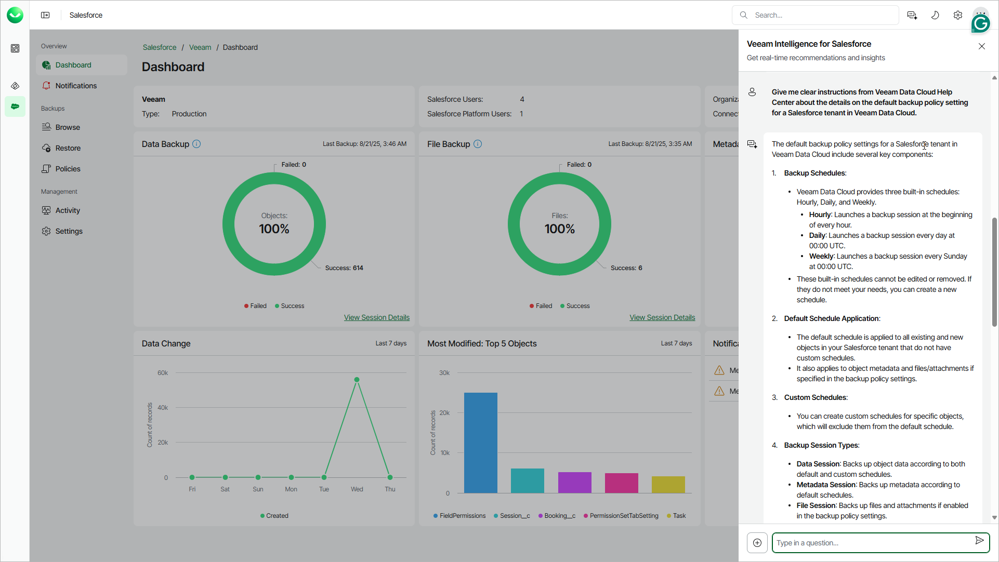

# Veeam Intelligence

Veeam Intelligence is an AI-powered chatbot that helps with common issues and questions related to Veeam products. It is trained on Veeam technical documentation to provide accurate answers. You can communicate with the Veeam chatbot in any language you want and create both simple and complex inquiries.

Before You Begin

Before you use Veeam Intelligence, consider the following:

* There is a limit of up to 200 questions per 24 hours for each license. If this limit is reached, Veeam Intelligence will stop processing further requests. You can continue using it after the 24-hour timeout expires.
* If the Veeam Intelligence service is overloaded, your request may be canceled.
* Screenshots and other images are not supported in chatbot prompts.
* Do not share any confidential information when using Veeam Intelligence as the queries are sent outside your organization.
* Veeam takes no responsibility for the accuracy of the information that the chatbot provides.
* Veeam Intelligence is under constant development. For more information on Veeam Intelligence updates, see [this Veeam KB article](https://www.veeam.com/kb4539).

Using Veeam Intelligence

To ask Veeam Intelligence a question, start a new conversation within a specific Veeam Data Cloud product. The replies from Veeam Intelligence are standardized text blocks in Markdown format. At the end of every answer, the chatbot adds links to relevant Veeam documentation and Knowledge Base articles.

If you find the answer insufficient, you can add more details. The Veeam Intelligence chatbot retains the conversation context and previous questions within a current session, so you do not have to repeat anything.

To start a new conversation:

1. Select a workload you want to work with. For example, Entra ID or Salesforce.
2. Click the Veeam Intelligence button in the upper right.
3. In the chat window, type a question. Consider the following examples:

* How to add an Entra ID tenant?
* Where can I view Veeam Data Cloud backup session logs?
* How to restore a sign-in log?

You can click the plus button next to the prompt field to view more examples of recommended prompts.

1. Click the send button to send your question.

