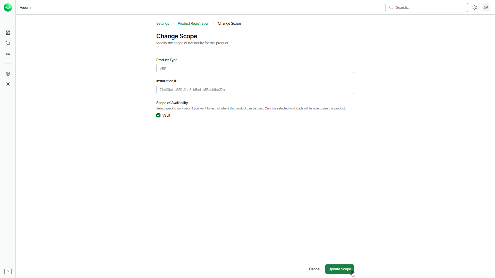

# Editing Product Scope

The scope of availability defines which workloads can use a registered product. After you register a product, you can change its scope of availability, but you cannot change the organization, product type or installation ID.

To change the scope of availability for a registered product, do the following:

1. Click the settings icon in the top-right corner.
2. Select Product Registration.
3. On the Product Registration tab, in the Actions column of the product you want to edit, click the menu icon and select Change Scope.
4. In the Scope of Availability section, select or clear the check boxes next to the workloads you want to allow or prevent from using the product.
5. Click Update Scope to save the changes.

Page updated 2026-07-23
