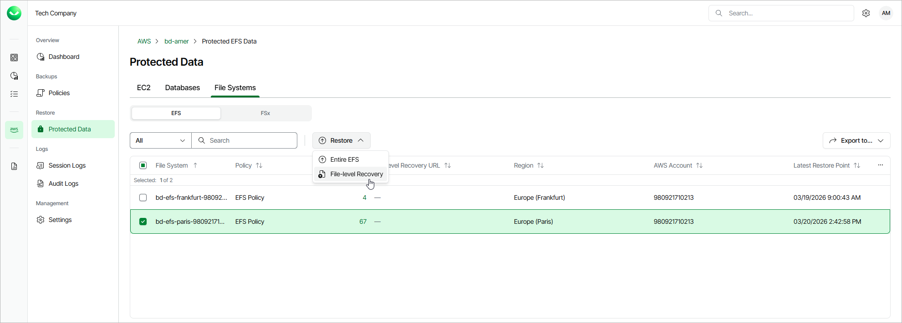

# Step 1. Launch EFS File-level Recovery Wizard

To launch the EFS File-level Recovery wizard, do the following:

1. On the AWS page, locate a tenant that has access to resources that you want to restore, and click Manage in the Actions column.
2. On the tenant administration page, navigate to Protected Data > File Systems > EFS.
3. Select the file system whose files and folders you want to recover, and click Restore > File-level Recovery.

Alternatively, click the link in the Restore Points column. Then, in the Available Restore Points window, select the necessary restore point and click Restore > File-level Recovery.

