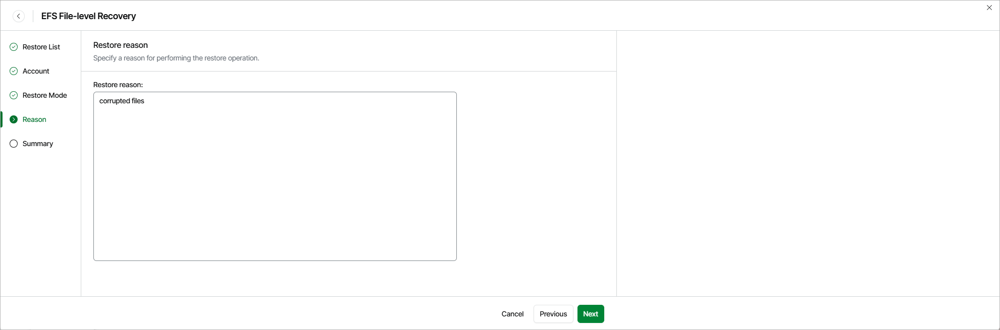

# Step 5. Specify Restore Reason

At the Reason step of the wizard, you can specify a reason for restoring the files and folders. The information you provide will be saved in the session history and you can reference it later.

