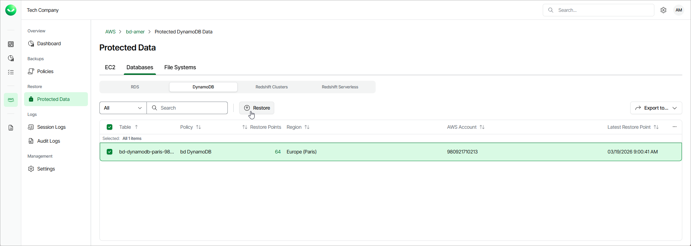

# Step 1. Launch DynamoDB Restore Wizard

To launch the DynamoDB Restore wizard, do the following:

1. On the AWS page, locate a tenant that has access to resources that you want to restore, and click Manage in the Actions column.
2. On the tenant administration page, navigate to Protected Data > Databases > DynamoDB.

1. Select the DynamoDB table that you want to restore, and click Restore.

Alternatively, click the link in the Restore Points column. Then, in the Available Restore Points window, select the necessary restore point and click Restore.

|  |
| --- |
| Note |
| You can restore multiple DynamoDB tables if they belong to same AWS account only. |

