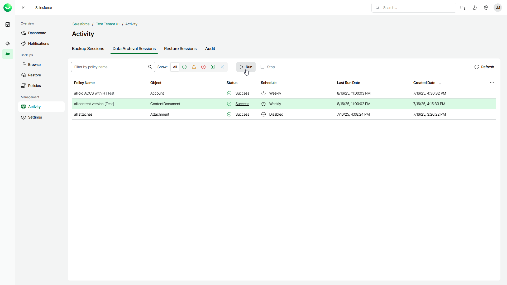

# Starting and Stopping Archival Sessions

If you do not want to start or stop the entire archival policy, you can start a new session or stop the latest running session of a policy.

To start a new archival session:

1. On the Salesforce page, click the name of the tenant you want to manage.
2. Select Activity.
3. Select the Data Archival Sessions tab.
4. Choose the necessary policy and click Run.

To stop an archival session:

1. On the Salesforce page, click the name of the tenant you want to manage.
2. Select Activity.
3. Select the Data Archival Sessions tab.
4. Choose the necessary policy and click Stop.
5. In the Confirm Archival Job Stop window, click Yes to confirm the action.

