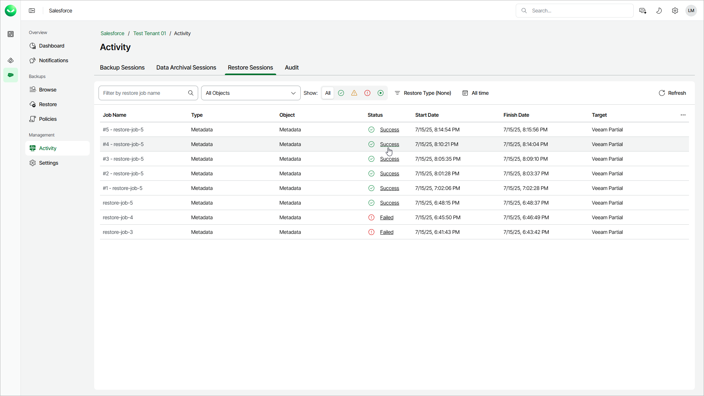
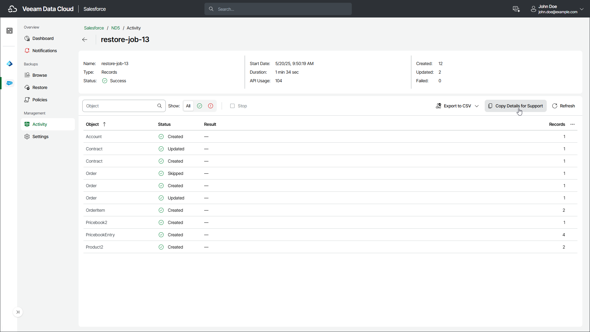

# Viewing Restore Sessions

In this article

To perform a restore job, Veeam Data Cloud starts a new session. You can check the statistics of all running and completed restore sessions.

Veeam Data Cloud displays only Salesforce records that have been processed by the restore session. If a record status is displayed as Skipped, this record has been skipped from processing because it already exists in Salesforce and has the same data as the backed-up record data.

To view the list of restore sessions, do the following:

1. On the Salesforce page, click the name of the tenant you want to manage.
2. Select Activity.
3. Select the Restore Sessions tab.

To view session details, click the link in the Status column.

On the session page, Veeam Data Cloud displays only the items that have been processed during the restore session. The record and file items are grouped by Salesforce object, status and error code, which is why some objects may appear on the page multiple times. Metadata files are unique and are not grouped in rows.

To export the list of items as a CSV file, click Export to CSV and choose whether you want to export all records or records of a specific Salesforce object only. The file will be downloaded to your local machine.

If you want to provide [Veeam Customer Support](https://my.veeam.com/my-cases) with details of the restore session, click Copy Details for Support to copy the details to your clipboard. The copied details include Organization Id, Tenant Id, Restore Job Id and Target Id.

Page updated 10/17/2025
