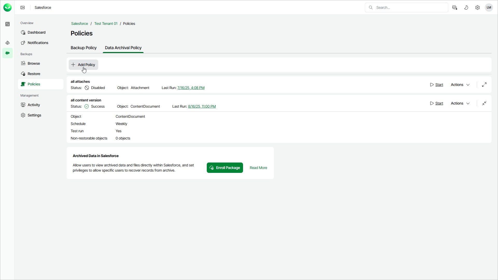

# Step 1. Launch Add Archival Policy Wizard

To launch the Add Archival Policy wizard, do the following:

1. On the Salesforce page, click the name of the tenant you want to manage.
2. To view the policies created for this tenant, select Policies on the left.
3. On the Data Archival Policy tab, click Add Policy.

