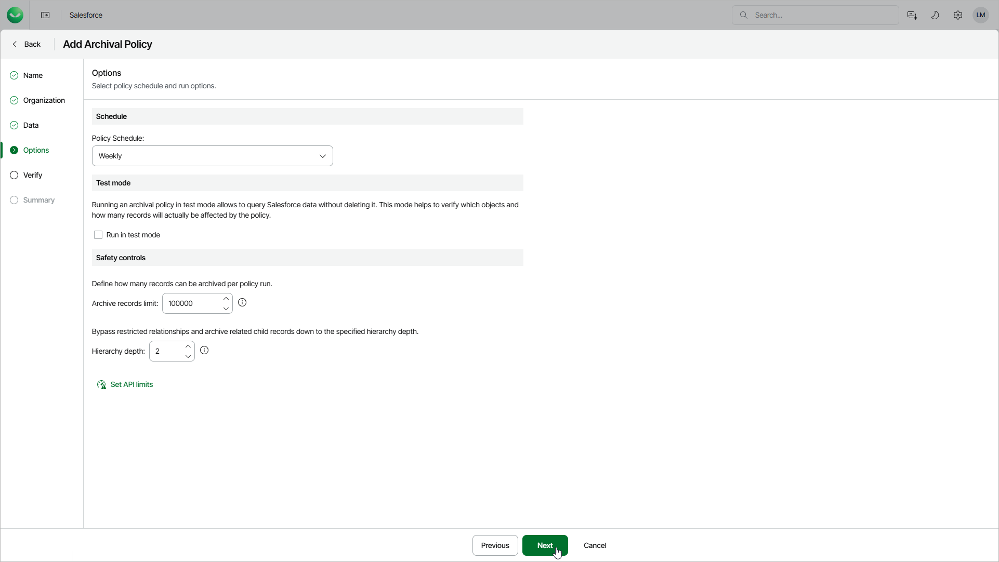

# Step 5. Configure General Settings

At the Options step of the wizard, you can select an archival schedule, specify API request and safety control limits and run the policy in the test mode.

1. In the Schedule section, choose whether you want to launch the policy every day, every week, every month or according to a custom schedule.
2. In the Test mode section, select the Run in test mode option to to run the archival policy in the test mode without actually deleting any data. Then, either wait for the policy to run according to the selected schedule or run it manually after you finish working with the Add Archival Policy wizard. When the archival session completes, you can check the number of records that will be archived for both the selected object and all its child objects.
3. By default, Veeam Data Cloud archives up to 100,000 records during one archival session to avoid performance issues. In the Safety controls section, you can adjust this limit taking into account the number of records that has been calculated at the previous step.

If the limit that you specify is less than the calculated number of records, the product will archive only the specified number of records while other records will be archived later, during subsequent archival sessions. Note that Veeam Data Cloud can archive data during subsequent archival sessions only after running the related backup policy — this allows the product to preserve data consistency between backup sessions.

1. By default, Veeam Data Cloud deletes linked child records using restricted relationships (that is, required lookup field relationships and optional lookup field relationships with the Delete this record also option enabled) of the 1st and 2nd hierarchy levels only. In the Safety controls section, you can adjust the depth level. The hierarchy depth settings do not apply to master-detail relationships.

Consider the following example. You want an archival policy to delete child records in the root object 1 level deep down the hierarchy where records in the root object are linked to a child record using master-detail relationships. In this case, Veeam Data Cloud will take the following steps while archiving records:

1. Delete the child record.
2. Proceed to deeper hierarchy levels until the 1st level child records linked using restricted relationships are detected.
3. Delete the detected 1st level child records with restricted relationships.
4. Proceed to deeper levels and keep deleting master-detail relationships until the 2nd level child records linked using restricted relationships are detected.
5. Keep the detected 2nd level child records and stop proceeding to deeper levels of the child hierarchy for this root record.
6. Try to finalize the archival operation. If deeper levels of child hierarchy contain records linked using restricted relationships, the operation will complete with an error and Veeam Data Cloud will not be able to delete these child records. To work around the issue, set a deeper hierarchy level or create a dedicated archival job for the object you have an issue with.

1. To specify thresholds for REST API and BULK API requests that must not be exceeded during archival operations, click Set API limits and enter the necessary threshold values (in percent) in the Set API limits window. Since the total number of API requests that can be sent to Salesforce within 24 hours is [limited for each Salesforce tenant](https://developer.salesforce.com/docs/atlas.en-us.salesforce_app_limits_cheatsheet.meta/salesforce_app_limits_cheatsheet/salesforce_app_limits_platform_api.htm), the setting will help you ensure that Veeam Data Cloud does not conflict with other applications that use API requests for integration with Salesforce. To do that

By design, Veeam Data Cloud checks the number of remaining API requests every time it starts a new policy session:

* If any of the specified thresholds is breached, the session fails with an error indicating that the API request limit has been exceeded.
* If none of the specified thresholds is breached, Veeam Data Cloud starts processing child objects added to the policy one by one.

Every time it processes a new child object, it checks the number of remaining API requests — if any of the specified thresholds is breached, the session fails with an error indicating that the API request limit has been exceeded, and all child objects that have not been processed yet remain undeleted. However, Veeam Data Cloud continues sending requests to Salesforce to archive child objects whose processing started before the session failed. The latter may cause Veeam Data Cloud to accidentally exceed the maximum limit of API requests that you specified.

