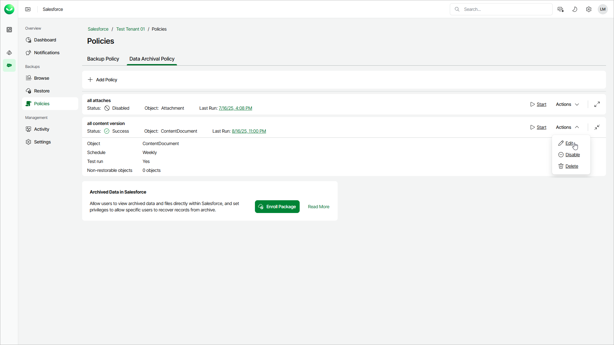

# Editing Archival Policies

In this article

You can edit archival policies created in Veeam Data Cloud. For example, you may need to modify the policy schedule, change API limits, and so on.

|  |
| --- |
| Important |
| If the list of backed-up objects has been changed (for example, new objects have been added to Salesforce or any objects have been excluded from the backup), you must edit all archival policies related to these objects. |

To edit an archival policy, do the following:

1. On the Salesforce page, click the name of the tenant you want to manage.
2. To view the policies created for this tenant, select Policies on the left.
3. On the Data Archival Policy tab, find the policy you need and select Actions > Edit.
4. To complete the Edit Archival Policy wizard, you can follow the steps described in [Creating Archival Policies](sf_archival_policies_create.md).

Page updated 10/17/2025
