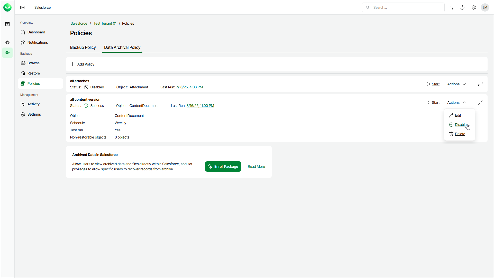

# Enabling and Disabling Archival Policies

In this article

By default, Veeam Data Cloud runs all created archival policies according to the specified schedules. However, you can temporarily disable an archival policy so that Veeam Data Cloud does not run the policy automatically. You will still be able to manually start or enable the disabled archival policy at any time you need.

To enable an archival policy, do the following:

1. On the Salesforce page, click the name of the tenant you want to manage.
2. To view the policies created for this tenant, select Policies on the left.
3. On the Data Archival Policy tab, find the policy you need and select Actions > Enable.

To disable an archival policy, do the following:

1. On the Salesforce page, click the name of the tenant you want to manage.
2. To view the policies created for this tenant, select Policies on the left.
3. On the Data Archival Policy tab, find the policy you need and select Actions > Disable.

Page updated 10/17/2025
