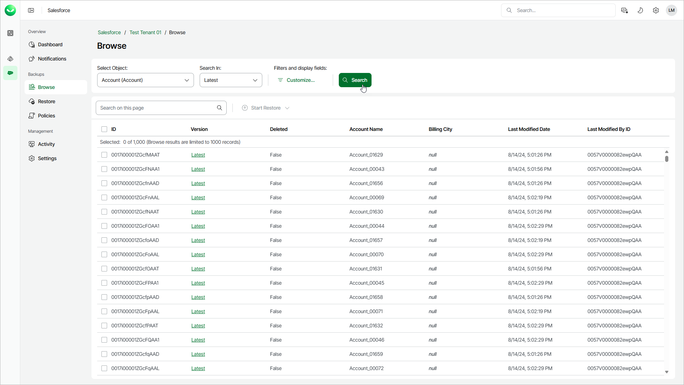

# Browsing Backups

Veeam Data Cloud allows you to view backed-up data of a specific Salesforce tenant before you restore it.

To browse backed-up data, do the following:

1. On the Salesforce page, click the name of the tenant you want to manage.
2. To browse the tenant backups, select Browse on the left.
3. From the Select Object list, select a Salesforce root object whose records you want to view.

For a Salesforce object to be displayed in the list of available root objects, it must have a backup. If the list does not contain the necessary object, the object either does not have a backup or cannot be restored. The object may not have a backup for the following reasons:

* The object was excluded from the backup policy that protects the Salesforce tenant to which this object belongs.
* The Salesforce user whose permissions are used for backup operations does not have access to the object.
* Backup of the object is not supported in the current product version. For more information, see [Unsupported Salesforce Objects](sf_unsupported_objects.md).

1. From the Search In list, select one of the following options:

* Select Latest to display the latest record versions only.
* Select Modified Date to display all record versions for a specific time period. To modify the time period, click the Calendar icon in the From and To fields.

1. To filter the records and select display fields, click the filter icon and follow the steps described in [Configuring Data Filters](sf_backup_browse_filters.md) and [Choosing Display Fields](sf_backup_browse_fields.md).
2. To display all records that meet the search conditions, click Search.

If you want to restore any of the records or record fields, select check boxes next to the necessary records, click Start Restore and complete the Restore Records or Restore Field Values wizard as described in section [Creating Restore Jobs](sf_creating_restore_jobs.md).

You can also choose the version of each record that will be restored. To do that, click the link in the Version column and select the necessary record version from the Restore point list.

|  |
| --- |
| Tip |
| * To help you choose a version, Veeam Data Cloud displays both the content of the selected backed-up record and the content of the record currently stored in Salesforce. If you want to view only those record fields that have changed since the backup was created, set the Compare changes toggle to On. * If the selected records contain encrypted fields, only users assigned the Salesforce:Administrator and Salesforce:BackupOperator roles will be able to view and compare values of these fields. |

