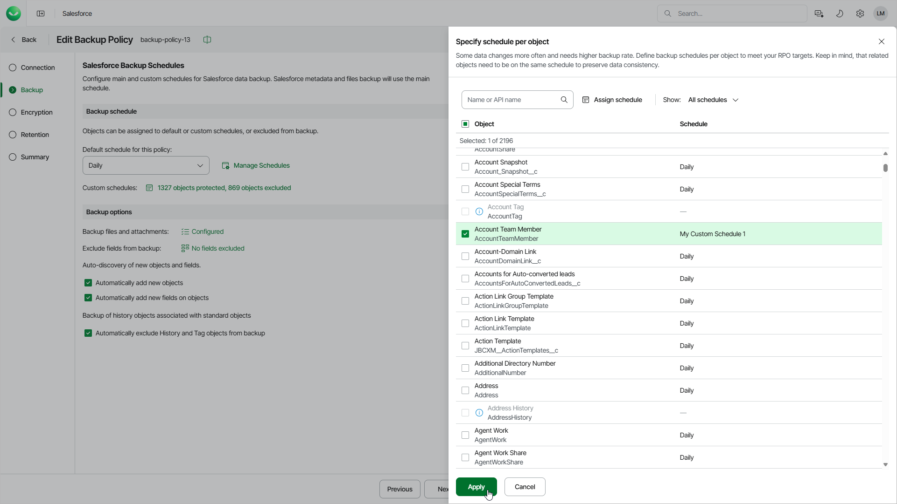

# Specifying Custom Schedules for Specific Objects

In this article

If some objects are updated frequently and need to be backed up more or less often than other objects belonging to the Salesforce tenant, you can assign custom schedules to these objects. Veeam Data Cloud will launch a separate backup session to protect each group of objects according to the assigned schedule. It is recommended that you assign the same schedule to related Salesforce objects to ensure that these objects can be restored properly.

If you assign a custom schedule to an object, the default schedule of the backup policy is not used to back up this object.

To assign a schedule to specific objects, do the following:

1. Click the link in the Custom schedules field.
2. In the Specify schedule per object window, do the following:

1. In the object list, select check boxes next to the objects that must be protected according to a specific schedule.
2. Click Assign schedule, choose the necessary schedule from the Schedule drop-down list in the Assign schedule window, and click Assign. If none of the available schedules meets your business needs, you can create a new schedule. To learn how to create schedules, see [Managing Schedules](sf_backup_policies_edit_backup_manage_schedule.md).

By default, Veeam Data Cloud backs up all supported Salesforce objects. However, some Salesforce objects cannot be restored, such as history objects. If you do not want to back up these or any other objects of the tenant, you can exclude them from the backup policy. To do that, select the Exclude from backup option from the Schedule drop-down list.

Salesforce objects that are not backed up by Veeam Data Cloud are listed in [Unsupported Salesforce Objects](sf_unsupported_objects.md).

1. Click Apply to save the changes.

|  |
| --- |
| Note |
| The User and Organization objects are automatically added to every schedule configured for the backup policy. You cannot exclude these objects manually. These objects are backed up every time the default schedule or a custom schedule assigned to specific objects starts the backup policy. |

Page updated 8/6/2025
