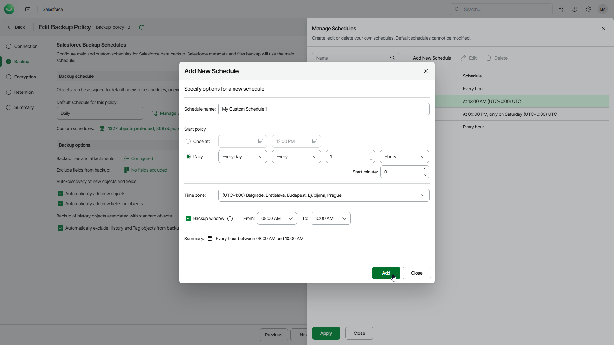

# Managing Schedules

You can create and edit and delete your own schedules if the option is available in your subscription. You can create multiple schedules; however, only the schedule that you set as the default for your backup policy and the custom schedules assigned to specific objects can start the backup policy.

|  |
| --- |
| Important |
| * You cannot delete a schedule that is used to back up any objects in the backup policy. If you want to delete such a schedule, you must first specify a schedule that will replace the deleted one.  * You cannot delete a schedule that is used for an archival policy. [Edit the archival policy settings](sf_archival_policies_create_options.md#schedule) to choose another schedule — and then try deleting the backup schedule again. |

To create a new backup schedule for the policy, do the following:

1. In the Backup schedule section, click Manage Schedules.
2. In the Manage Schedules window, click Add New Schedule.

1. In the Add New Schedule window, specify the schedule settings:

1. In the Schedule name field, specify a name for the schedule. The name must be unique within the Salesforce tenant.
2. In the Start policy section, select the schedule type:

* To run a backup policy once, select Once at and specify the time when the backup policy must run.

Note that you cannot combine one-time schedules with periodic default and custom schedules for the same backup policy. If you select the Once at type of schedule as the default policy schedule, you must manually remove all periodic schedules configured for Salesforce objects, wait for the policy session to complete, and then re-configure periodic schedules for the policy.

* To run a backup policy periodically, select Daily and specify an interval in hours that defines how often the policy must run. Use the Start minute field to set the minutes of an hour when you want the policy to start.

For example, If you specify to run a backup policy every 9 hours at 30 minutes of an hour, Veeam Data Cloud will start the policy according to the following schedule (UTC): Mon 00:30, Mon 09:30, Mon 18:30, Tue 00:30, Tue 09:30, Tue 18:30 and so on.

|  |
| --- |
| Note |
| * If your Veeam Data Cloud for Salesforce subscription has more than 200 licensed users, the maximum backup frequency for a custom schedule is 15 minutes. * If your Veeam Data Cloud for Salesforce subscription has 200 or less licensed users, the maximum backup frequency for a custom schedule is 1 hour. |

1. From the Time zone drop-down list, select a UTC time offset. By default, the time zone of your browser is selected.
2. [Applies if you have selected the Daily option] If you want the backup policy to run only during the specific period of time, select the Backup window check box and specify the time interval.
3. Review the settings and click Add.

