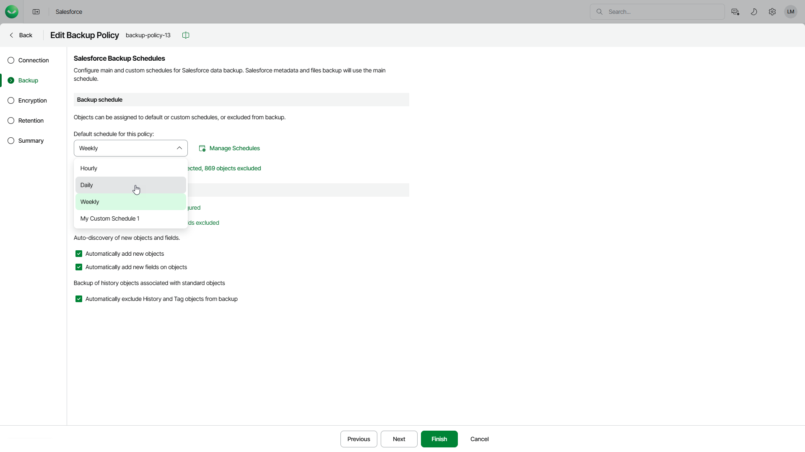

# Step 3a. Configure Backup Schedules

In this article

In the Backup schedule section of the Backup step of the wizard, you can adjust default and custom schedules of the backup policy. Default schedule is applied to all existing and new objects in your Salesforce tenant. Objects that use custom schedules are excluded from the default schedule.

Veeam Data Cloud has 3 built-in schedules:

* Hourly — this schedule launches a backup policy session at the beginning of every hour.
* Daily — this schedule launches a backup policy session every day at 00:00 UTC.
* Weekly — this schedule launches a backup policy session every Sunday at 00:00 UTC.

|  |
| --- |
| Note |
| You cannot edit or remove the built-in schedules. If none of the built-in schedules meets your business needs, you can create a new schedule. To learn how to create schedules, see [Managing Schedules](sf_backup_policies_edit_backup_manage_schedule.md). |

Specifying Default Schedule for Backup Policy

You can select one of the built-in schedules or create a new one as described in section [Managing Schedules](sf_backup_policies_edit_backup_manage_schedule.md).

The default schedule is applied to the following Salesforce data:

* All objects of the Salesforce tenant that have no custom schedules assigned. For details, see [Specifying Custom Schedules for Specific Objects](sf_backup_policies_edit_backup_custom_schedule.md).
* Object metadata.
* Files and attachments if you specify any in the Backup files and attachments field. For details, see [Configure Additional Options](sf_backup_policies_edit_backup_options.md).
* New objects and fields if you select this option. For details, see [Configure Additional Options](sf_backup_policies_edit_backup_options.md).

To set a default schedule, select one of the options from the Default schedule for this policy list.

Page updated 8/6/2025
