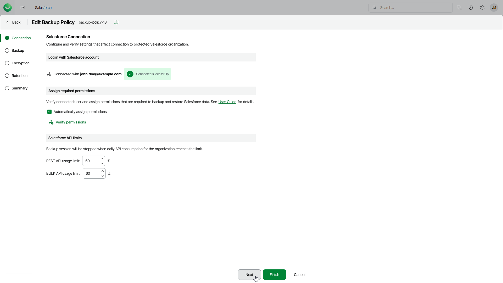

# Step 2. Configure API Limits and Verify Permissions

In this article

At the Connection step of the wizard, you can verify user permissions and modify the limits for API calls sent by Veeam Data Cloud to Salesforce.

The total number of API requests that can be sent to Salesforce within 24 hours is limited for each Salesforce tenant. To ensure that Veeam Data Cloud does not conflict with other applications that use API requests for integration with Salesforce, specify thresholds for REST API and BULK API requests that must not be exceeded during backup operations. For more information on the API request limits, see [Salesforce Documentation](https://developer.salesforce.com/docs/atlas.en-us.salesforce_app_limits_cheatsheet.meta/salesforce_app_limits_cheatsheet/salesforce_app_limits_platform_api.htm).

Veeam Data Cloud checks the number of remaining API requests every time it starts a new policy session:

* If any of the specified thresholds is breached, the session fails with an error indicating that the API request limit has been exceeded.
* If none of the specified thresholds is breached, Veeam Data Cloud starts processing objects added to the policy one by one.

Every time it processes a new object, Veeam Data Cloud checks the number of remaining API requests — if any of the specified thresholds is breached, the session fails with an error indicating that the API request limit has been exceeded, and all objects that have not been processed yet remain unprotected. However, Veeam Data Cloud continues sending requests to Salesforce to back up objects whose processing started before the session failed. The latter may cause Veeam Data Cloud to accidentally exceed the maximum limit of API requests that you specified.

To edit Salesforce connection settings, do the following:

1. To verify whether the specified user has enough permissions to perform backup and restore operations, click Verify permissions.

If any of the permissions are missing, grant them in the Salesforce console as described in [Salesforce documentation](https://help.salesforce.com/s/articleView?id=sf.permissions_about_users_access.htm&language=en_US&type=5). You can also change the user used to connect to the Salesforce tenant. For details, see [Configuring Backup Service Connection](sf_settings_connections.md).

Veeam Data Cloud can assign the required permissions automatically to the specified user. To allow Veeam Data Cloud to assign the permissions, select Automatically assign permissions.

1. To adjust the REST API and BULK API usage limits, enter the necessary threshold values in the Salesforce API limits section.

Page updated 11/13/2025
