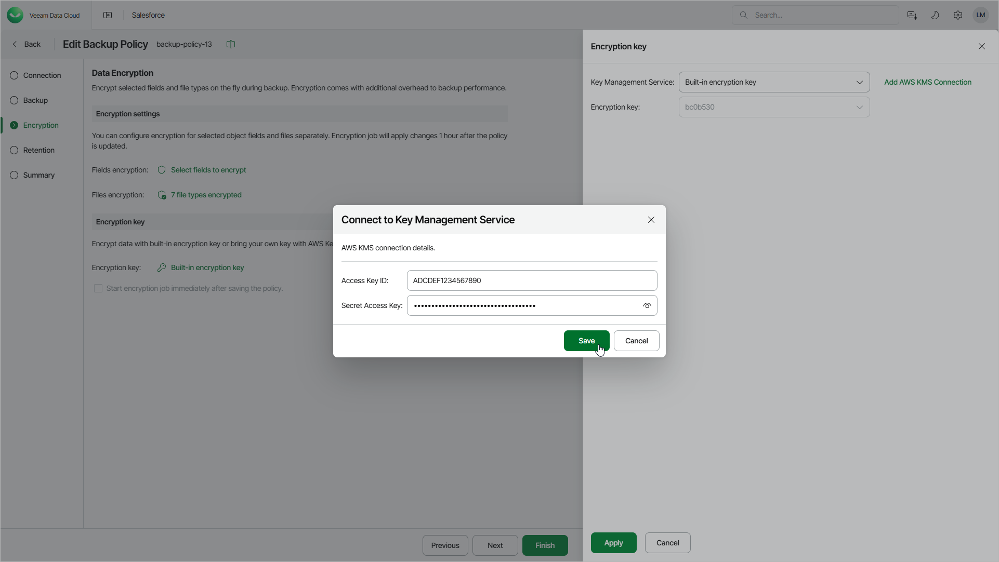

# Step 4. Edit Encryption Settings

Veeam Data Cloud encrypts backed-up fields and files and can extend Salesforce Shield Platform Encryption to secure sensitive data stored in backups from bad actors. For more details on Shield Platform Encryption, see [Salesforce Documentation](https://help.salesforce.com/s/articleView?id=xcloud.security_pe_concepts.htm&type=5). To encrypt data, Veeam Data Cloud uses data key that is enciphered with either a Veeam Data Cloud master key or an Amazon Web Services Key Management Service (AWS KMS) master key. The Veeam Data Cloud master key is configured as a default option to encrypt all file types and the object fields that you select to encrypt.

To extend Salesforce Shield Platform Encryption, enable encryption for the same fields that you have configured to encrypt with Shield Platform Encryption in your Salesforce tenant. Encryption is mandatory for all file types, and you cannot disable it.

When you edit a backup policy and enable encryption for already protected fields, Veeam Data Cloud runs an encryption session. Keep in mind that for larger Salesforce tenants, encryption operations may take significant time to complete. When the encryption process completes, Veeam Data Cloud further runs data and file sessions instead of encryption sessions to encrypt the protected fields and files on the fly. For more information on types of backup sessions, see [Backup Session Types](sf_activity_backup_session_types.md).

At the Data Encryption step of the wizard, you can configure the following encryption settings:

1. In the Encryption settings section, choose whether you want to encrypt specific object fields. If you do not select any object fields, this data will not be encrypted. You can select a maximum of 10 fields for an object.

For an object field to be displayed in the list of available fields, both the object and the field must be added to the backup scope specified at the previous step. For a file type to be displayed in the list of encrypted file types, it must be included in the list of backup files and attachments specified at the previous step.

|  |
| --- |
| Important |
| * Veeam Data Cloud supports encryption of the following Salesforce data types only: Text, Text Area, Text Area (Long), Text Area (Rich), Text (Encrypted), Address, Number, Email, Phone, Text Formula, Number Formula, Percent Formula, Currency Formula, Geolocation. * Encryption for the Picklist and Picklist (Multi-Select) field types is not supported. For more information on Salesforce field types, see [Salesforce Documentation](https://help.salesforce.com/s/articleView?id=sf.custom_field_types.htm&type=5).  * If an object record that you want to back up contains fields that have been specified as filtering conditions in an archival policy, you will not be able to encrypt these fields. [Edit the filtering criteria settings](sf_archival_policies_create_data.md) of the archival policy — and then modify the backup policy settings to encrypt these fields. |

1. In the Encryption key section, choose whether you want to encrypt backed-up data using an AWS master key or a master key generated by Veeam Data Cloud. If you want to use an AWS master key, you must also select the region to which the key belongs.

For an AWS master key to be displayed in the list of available keys, it must be added to the selected region in an AWS account as described in [AWS Documentation](https://docs.aws.amazon.com/kms/latest/developerguide/create-keys.html), and this account must be connected to Veeam Data Cloud as described in section [Configuring Encryption Settings](sf_configuring_encryption.md). If you have not connected the AWS account beforehand, you can do it without closing the Add Backup Policy window. To do that, click Add AWS KMS Connection and follow the instructions provided in section [Adding AWS KMS Connections](sf_settings_kms_add.md).

You must not remove the AWS master key from the related AWS account. Otherwise, you will not be able to decrypt and restore backed-up data.

