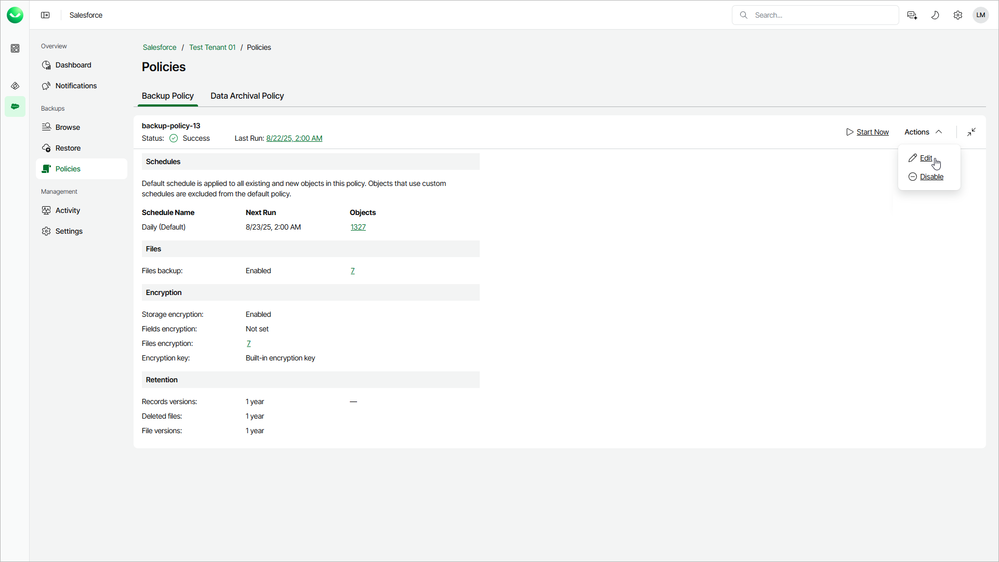

# Step 1. Launch Edit Backup Policy Wizard

To launch the Edit Backup Policy wizard, do the following:

1. On the Salesforce page, click the name of the tenant you want to manage.
2. To view the policies created for this tenant, select Policies on the left.
3. On the Backup Policy tab, select Actions > Edit.

