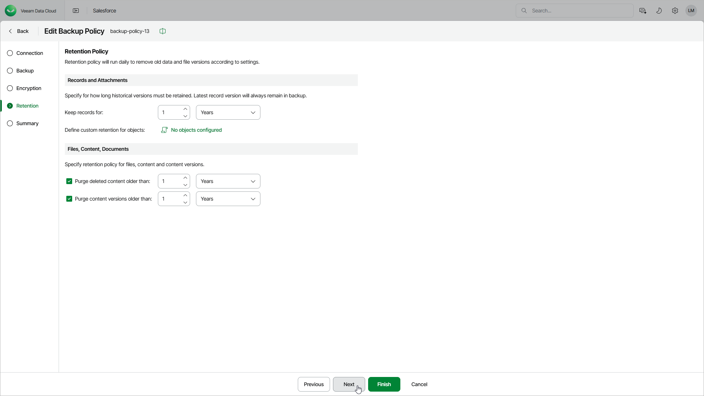

# Step 5. Edit Retention Settings

In this article

At the Retention step of the wizard, you can edit retention settings that define how long the created backups will be stored before being deleted. It allows you to comply with the data retention policy of your company.

Consider the following:

* The time period is calculated since record changes were backed-up, not since creation of the record itself.
* Veeam Data Cloud will always keep the latest version of a record in the backup even if the specified retention limit is reached and the record has been deleted from Salesforce.

* When Veeam Data Cloud deletes a record, all its associated attachments are deleted as well — but only if the following requirements are met:

* The attachments no longer exist in Salesforce.
* The attachments have backups.
* The attachments are older than the specified retention period.

To edit retention settings for the backup policy, do the following:

1. In the Records and Attachments section, specify retention settings for Salesforce records and attachments:

1. In the Keep versions for field, specify the number of days (weeks, months or years) for which you want to keep Salesforce history records and deleted attachments.
2. If you want to configure retention settings for specific objects, click the Define custom retention policy link.

In the Custom Retention Settings window, click Add Object, select the necessary object from the Object drop-down list, and specify the retention period. Click Apply.

Note that attachments associated with records to which custom retention settings are applied will be removed according to the main data and attachments retention policy specified in the Keep versions for field.

1. The settings specified in the Data and attachments retention policy section do not apply to backups of files, content and documents created by the policy. If you want Veeam Data Cloud to automatically delete these backups according to the retention policy, configure their own retention settings in the Files, Content, Documents section:

* To remove backups of files that were permanently deleted from Salesforce according to the retention policy, select the Purge deleted content older than option and specify the period after which these files will be removed.
* To remove backups of file versions, select the Purge content versions older than option and specify the period after which the outdated versions will be removed.

Page updated 3/28/2025
