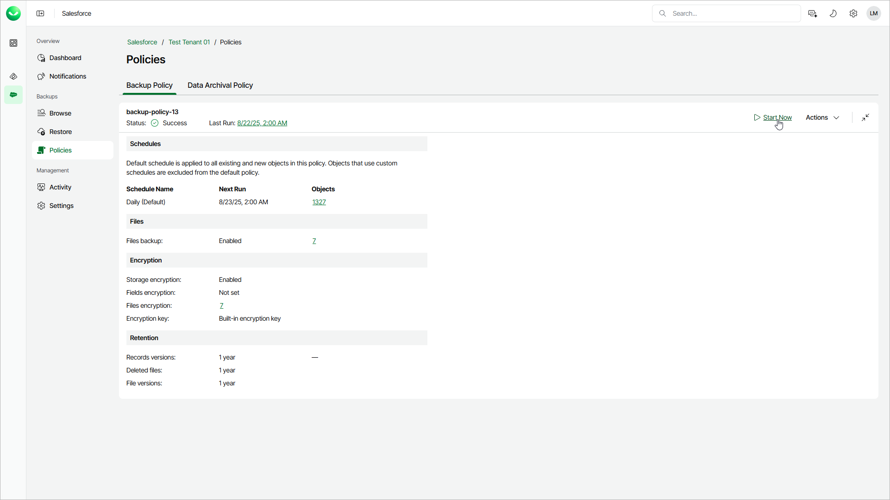

# Starting and Stopping Backup Policies

You can start a backup policy manually, for example, if you want to create an additional backup in the backup chain and do not want to modify the configured backup policy schedules. You can also stop a backup policy if processing of a session is about to take too long and you do not want the policy to affect the production environment during business hours.

When you start a backup policy, it will automatically launch all backup data, file and metadata sessions configured for this policy. You can start a a specific backup session in the Activity section. For details, see [Starting and Stopping Backup Sessions](sf_activity_backup_start_stop.md).

|  |
| --- |
| Note |
| If you want to start the backup policy because some Salesforce data was not backed up, consider reloading object fields or metadata instead. For details, see [Reloading Fields and Files](sf_activity_backup_reload_fields.md) and [Reloading Metadata](sf_activity_backup_reload_metadata.md). |

To start a backup policy:

1. On the Salesforce page, click the name of the tenant you want to manage.
2. To view the policies created for this tenant, select Policies on the left.
3. On the Backup Policy tab, click Start.

To stop a backup policy:

1. On the Salesforce page, click the name of the tenant you want to manage.
2. To view the policies created for this tenant, select Policies on the left.
3. On the Backup Policy tab, click Stop.
4. If you stop a running backup policy, click one of the following in the Confirm Session Stop window:

* Click Hard Stop to immediately stop the backup policy. In this case, Veeam Data Cloud will interrupt the currently running backup session, and the backup policy will acquire the Aborted status.
* Click Graceful Stop to complete backup for Salesforce objects that are already being processed by the backup session. Veeam Data Cloud will stop the policy execution when backup of the processed objects is finished, and the backup policy will acquire the Stopped status.

