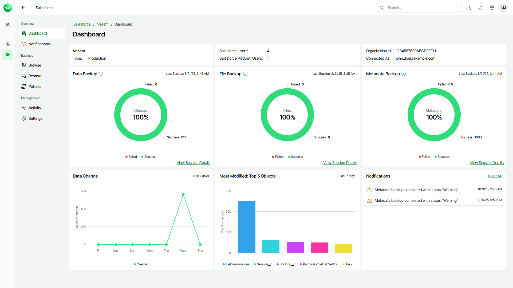

# Viewing Dashboard

The Veeam Data Cloud for Salesforce dashboard provides information on the backup state, recent changes and activities in the Salesforce tenant that you are currently managing.

To view the dashboard, do the following:

1. On the Salesforce page, click the name of the tenant you want to manage.
2. The dashboard is the landing page when you open a tenant. To return to the Salesforce tenant dashboard from a different page, click Dashboard.

The Dashboard page displays the following widgets.

* The Data Backup, File Backup and Metadata Backup widgets display the compliance of the backup state with the service level agreement (SLA).

* The backup state of an object is considered successful if the backup is successfully executed within the SLA defined by the policy schedule for that object.
* The backup state of a file type is considered successful if the backup is successfully executed within the SLA defined by the default policy schedule.
* The metadata backup is considered successful if the backup is successfully executed within the SLA defined by the default policy schedule.

Click a chart section that displays a specific status (Success, Failed) to view a backup session log with activities filtered by the respective status. Click View Session Details to display a complete session log of activities. For details, see [Activity](sf_activity.md).

* The Data Change widget displays information on number of created, updated and deleted records in your Salesforce tenant. Click the node in the chart to view the backup session log for the related time period. For details, see [Viewing Backup Sessions](sf_activity_backup.md).

* The Most Modified widget displays the top 5 objects with the most records modified in the last 7 days in your Salesforce tenant. Click a data bar in the chart to view a detailed chart of feature changes for the related object. Then, in the detailed chart, click a data bar to browse the backed-up object. For details, see [Browsing Backups](sf_backup_browse.md).
* The Notifications widget displays the recent unread notifications. You can view all notifications in the Notifications section. For details, see [Viewing Notifications](sf_notifications.md).

