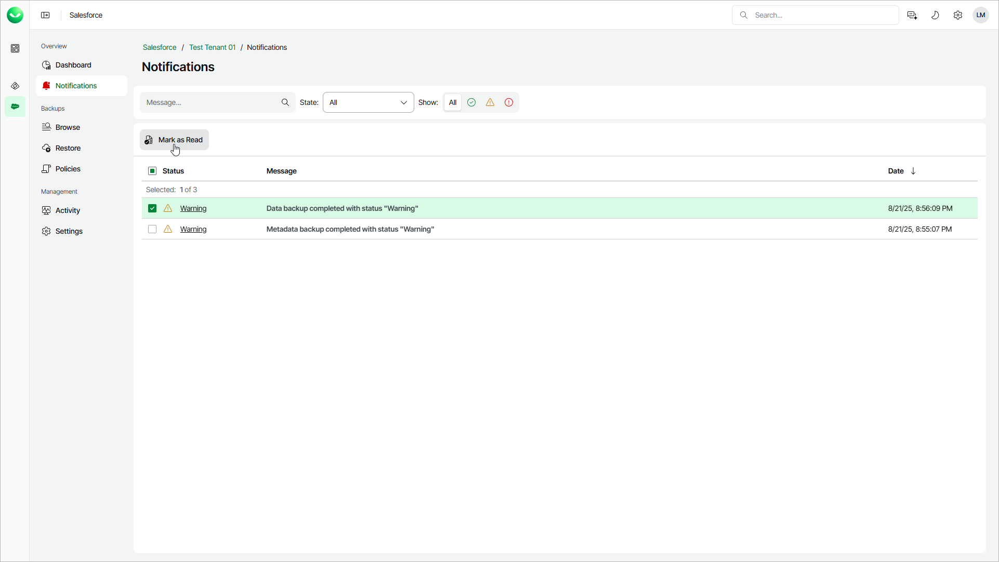

# Viewing Notifications

In this article

Veeam Data Cloud allows you to view the history of notifications and notification details. The retention period for notifications is 30 days. After this period, Veeam Data Cloud automatically deletes the notifications. You can configure notification settings for each Salesforce tenant. For details, see [Managing Notifications](sf_settings_notifications.md).

To view the details of a notification, do the following:

1. On the Salesforce page, click the name of the tenant you want to manage.
2. Select Notifications.
3. In the list of notifications, click the link in the Status column next to the notification you want to display. Veeam Data Cloud will display a session log with detailed information.

You can mark notifications as read. To mark notifications, select required notifications in the list and click Mark as Read. The notifications that are read are not displayed on the Dashboard page. For details, see [Viewing Dashboard](sf_dashboard.md).

Page updated 10/17/2025
