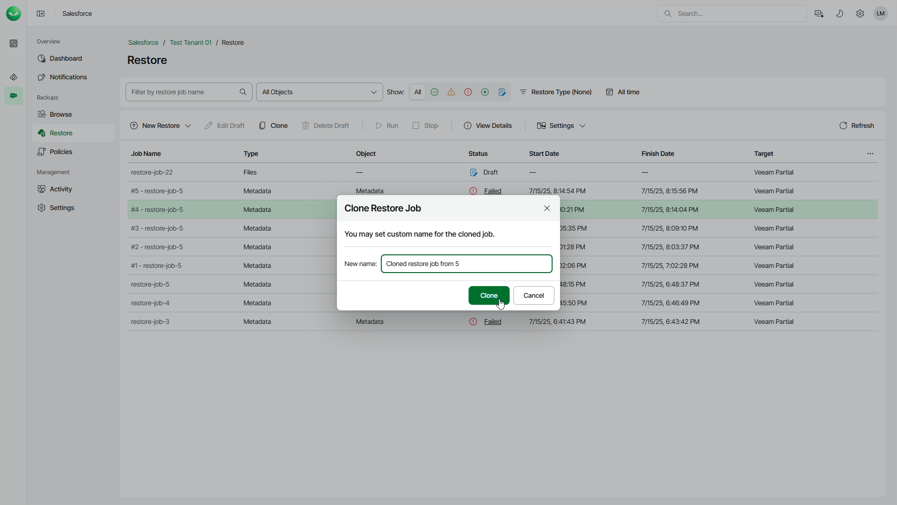

# Cloning Restore Jobs

You can clone a restore job if you want to launch it again or to create a new job based on the settings of the existing one. A cloned job is saved as a draft that you can edit before you stert the job.

Note that you cannot clone a running restore job.

To clone a restore job, do the following:

1. On the Salesforce page, click the name of the tenant you want to manage.
2. To view all restore jobs created for the tenant, select Restore on the left.
3. Select the necessary job.
4. Click Clone.
5. In the Clone Restore Job window, specify a name for the new job, and click Clone.

