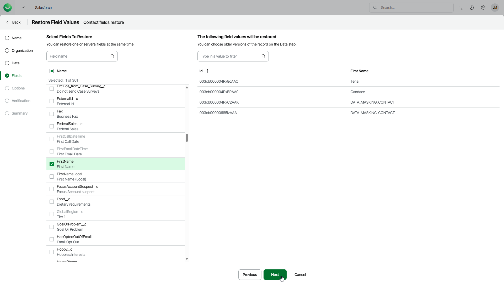

# Step 5. Select Fields to Restore

In this article

At the Fields step of the wizard, choose the fields whose values you want to restore. Consider that only values of the fields that are defined by Salesforce as updatable can be restored. For example, you cannot restore values of the read-only or formula fields. These fields will be grayed out.

To restore a Formula field type, create a metadata restore job. For details, see [Restoring Metadata](sf_restore_metadata.md).

Page updated 8/22/2025
