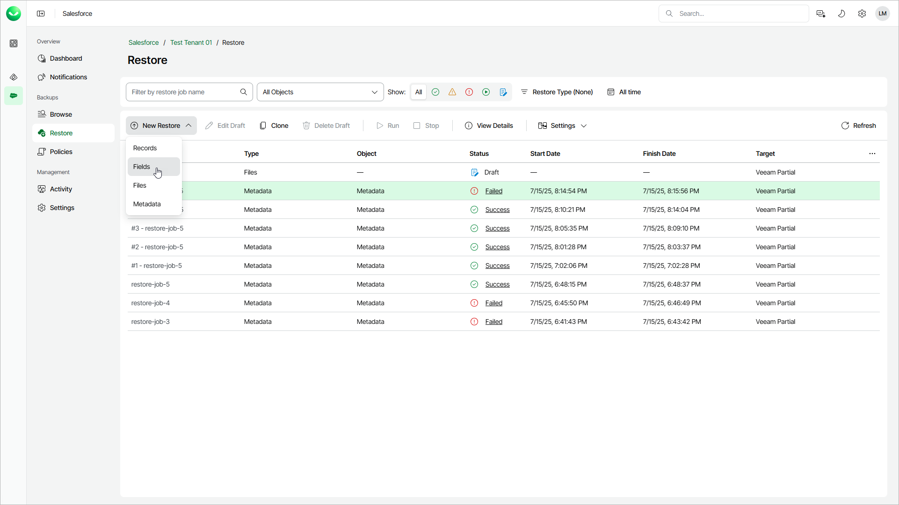

# Step 1. Launch Restore Field Values Wizard

In this article

To launch the Restore Field Values wizard:

1. On the Salesforce page, click the name of the tenant you want to manage.
2. To view all restore jobs created for the tenant, select Restore on the left.
3. Select New Restore > Fields.

Page updated 10/17/2025
