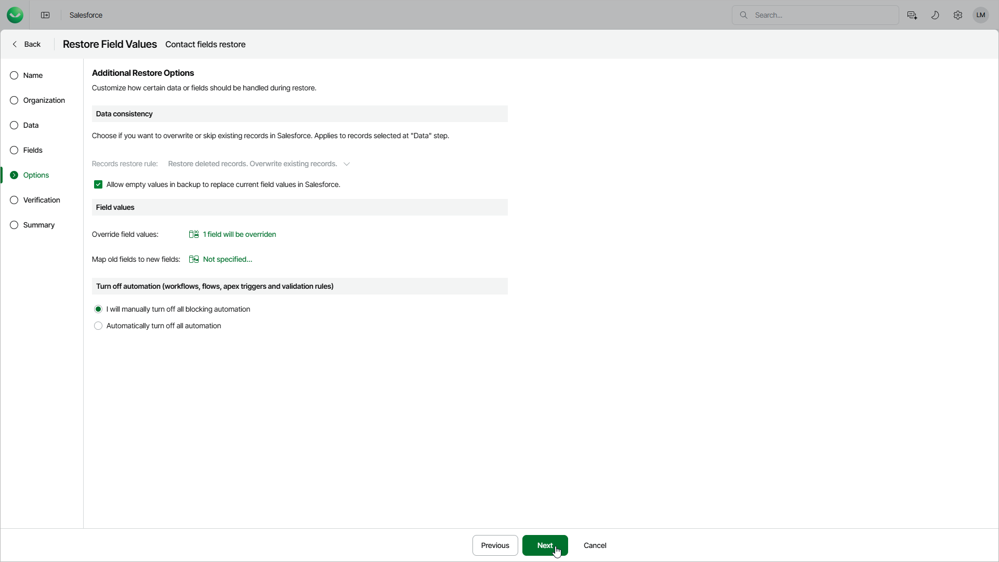

# Step 6. Configure Additional Restore Settings

In this article

At the Options step of the wizard, you can instruct Veeam Data Cloud to automatically replace current field values in Salesforce with null, overwrite field values manually, map fields of backed-up records to specific fields in Salesforce, and choose the way you want to deactivate blocking automation in Salesforce.

Automatic Field Overriding Settings

By default, Veeam Data Cloud restores only those records that have been deleted from Salesforce without updating the existing records. In the Data consistency section, you can decide whether you want to replace non-empty field values of the existing object records in Salesforce with empty (null) values of the backed-up records.

Manual Field Overriding Settings

In the Field values section, you can choose whether you want to override specific field values in the restored layouts and new labels (for example, in case of sandbox seeding when you need to mask sensitive data). To do that, click the link in the Override field values field, choose a field whose value you want to override and provide a new value.

For a record field to be displayed in the list of available fields, this record must be added to the restore job as described at the [Data](sf_restore_field_values_data.md) step. Keep in mind that if you restore an object record that contains encrypted fields to the same Salesforce tenant, these fields will be grayed out.

|  |
| --- |
| Tip |
| * When overriding time values, keep in mind that even though the management server and databases use the UTC time zone for all operations, Salesforce adjusts the time set for every Salesforce user according to the time zone settings defined for this user. To learn how to change default time zones in Salesforce, see [Salesforce Documentation](https://help.salesforce.com/s/articleView?id=000386323&type=1). * If you have instructed Veeam Data Cloud to mask data at the [Data](sf_restore_field_values_data.md) step, the data will be first masked and then overridden. |

Field Mapping Settings

In the Field values section, you can choose whether you want Veeam Data Cloud to populate fields of a restored record with values of a specific backed-up record. To do that, click the link in the Map old fields to new fields field, choose an object whose field values you want to overwrite, and map the necessary backed-up record fields to fields in the target Salesforce tenant. For an object or a field to be displayed in the list of available items, it must have a backup.

To export the list that contains all mapped fields as a CSV file, click Export to CSV. Veeam Data Cloud will save the file with the exported data to the default download folder on the local machine.

|  |
| --- |
| Important |
| * For security reasons, mapping of encrypted fields is not supported. * Overriding and mapping fields of the Text (Encrypted) type is not supported. |

Blocking Automation Settings

Business logic and automated rules configured in Salesforce can block Veeam Data Cloud restore operations or trigger undesirable side processes. You can choose either to manually deactivate Flows, Validation Rules, Workflow Rules, Lookup Filters, Process Builders and Apex Triggers in Salesforce or to instruct the product to bypass all blocking automation while performing a restore operation. To do that, select one of the options in the Turn off automation section:

* Select the I will manually turn off all blocking automation option, if you are a Salesforce Administrator and want to deactivate Flows, Validation Rules, Workflow Rules, Lookup Filters, Process Builders and Apex Triggers in Salesforce manually.
* Select the Automatically turn off all automation option to automatically update Flows, Validation Rules, Workflow Rules, Lookup Filters, Process Builders and Apex Triggers so that they are bypassed while the product performs the restore operation without impacting the Salesforce functionality. When you choose this option for a restore job for the first time, updating blocking automation will take significant time to complete. However, as the updates will be kept in Salesforce, all further restore operations will run faster.

Page updated 8/22/2025
