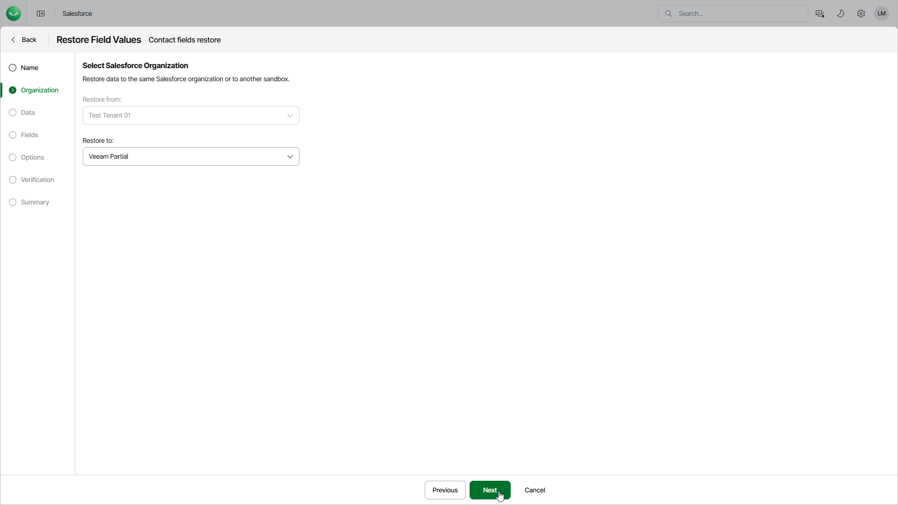

# Step 3. Select Target Tenant

In this article

At the Organization step of the wizard, you can choose to restore field values to the same Salesforce tenant or its sandbox copy.

To select another target tenant, use the Restore to drop-down list. The list contains only Salesforce tenants that are compatible with the source tenant.

|  |
| --- |
| Important |
| * The source and target Salesforce tenants must be located in the same region. * When you restore an object record that contains encrypted fields to the same tenant, Veeam Data Cloud decrypts and restores the fields. If you want to restore such a record from a production to a sandbox tenant, provide [override values for these fields](sf_restore_records_options.md); otherwise, the fields will not be restored. |

Page updated 8/22/2025
