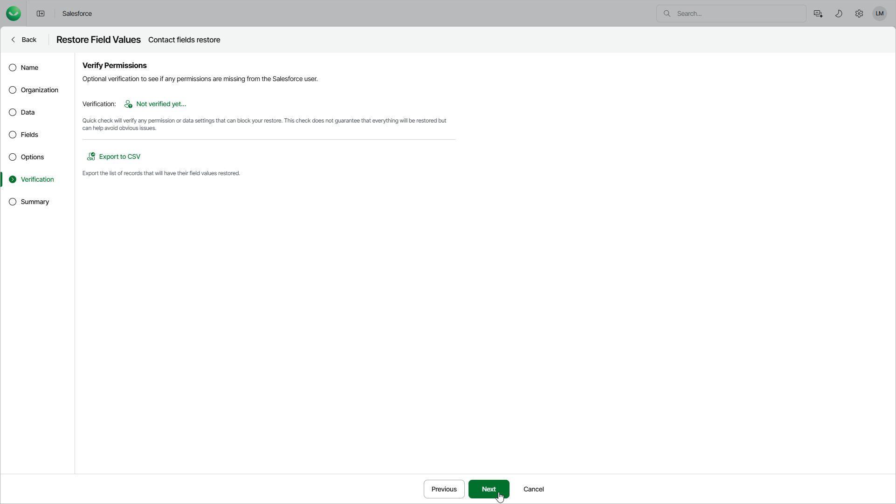

# Step 7. Check Permissions

At the Verification step of the wizard, verify whether the user that is used to perform the restore operation is assigned the permissions required to restore the selected Salesforce object. To do that, click the Not verified yet link and wait for the check to complete. If any of the permissions are missing, you must grant them in the Salesforce console manually as described in [Salesforce documentation](https://help.salesforce.com/s/articleView?id=sf.permissions_about_users_access.htm&language=en_US&type=5).

To export the list that contains all fields of the records selected at the [Data](sf_restore_field_values_data.md) step as a CSV file, click Download CSV File. Veeam Data Cloud will save the file with the exported data to the default download folder on the local machine.

