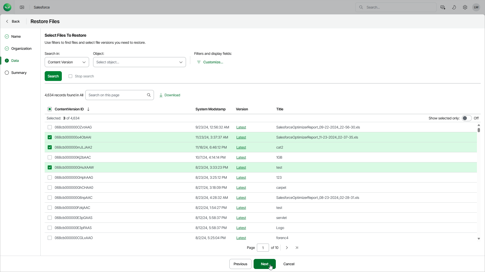

# Step 4. Select Files to Restore

In this article

At the Data step of the wizard, choose the files that you want to restore:

1. From the Search in list, select a Salesforce root object that defines a file type that you want to restore. The list contains Salesforce objects that have a backup.

When selecting a file type, consider the following:

* If you select the Attachment or ContentVersion file type, you will be able to narrow down the search scope by specifying a Salesforce object that is associated with files of this type.
* If you select the ContentVersion file type, you will be able to choose the version of each file that will be restored — to do that, click the link in the Version column and select the necessary file version from the Restore point drop-down list.

To help you choose a version, Veeam Data Cloud displays both the content of the selected backed-up file and the content of the file currently stored in Salesforce. If you want to view only those fields that have changed since the backup was created, set the Compare changes toggle to On.

* If you select the Document file type and choose a document whose folder no longer exists in Salesforce, Veeam Data Cloud will automatically restore this folder when restoring the document.

1. [Optional] To apply specific search conditions and reduce the number of search results, click Customize in the Filters and display fields field.

Veeam Data Cloud provides a number of built-in conditional operators (such as contains, equals, starts with, is null and so on) that can be used to send requests to databases. The time required to process a request depends on the operator you use — for example, processing a request with the equals operator will take less time than processing a request with the contains operator.

The Value field is case sensitive for the following operators: starts with, ends with, equals, in, not equal to, not in.

By default, filters are combined by the AND logical operator. That is, a record is displayed in the search results only if all the specified conditions are met. You can change this behavior by combining filters using different operators. To do that, set the Use filter logic toggle to On, and specify the filter logic expression using condition ordinal numbers, brackets and logical operators — for example, 1 AND (2 OR 3) AND NOT 4.

1. To display the list of records that meet the search conditions, click Search.
2. Select the necessary files. You can select up to 500,000 files in one restore job.

|  |
| --- |
| Tip |
| You can download up to 10 files to the local machine. To do that, select the necessary files and click Download. Note that if the selected files are encrypted, only users assigned the OrganizationAdmin, Salesforce:Administrator and Salesforce:BackupOperator roles will be able to download these files. |

Page updated 8/22/2025
