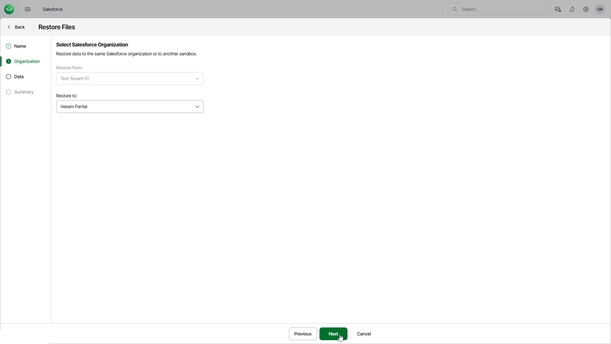

# Step 3. Select Target Tenant

At the Organization step of the wizard, you can choose to restore field values to the same Salesforce tenant or its sandbox copy.

To select another target tenant, use the Restore to drop-down list. The list contains only Salesforce tenants that are compatible with the source tenant.

|  |
| --- |
| Important |
| * The source and target Salesforce tenants must be located in the same region. * If you choose to restore an encrypted file to a production tenant, Veeam Data Cloud will decrypt the file and fully restore its content. However, if you choose to restore an encrypted file to a sandbox tenant, Veeam Data Cloud will not decrypt the file for security reasons and therefore will create only an empty copy of this file. |

