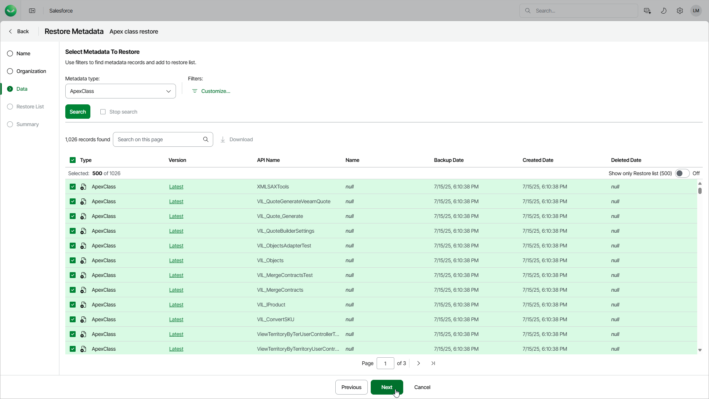

# Step 4. Select Metadata to Restore

In this article

At the Data step of the wizard, choose metadata files that you want to restore:

1. From the Metadata type list, select a metadata type to search for all metadata files of this type. The list contains the metadata types that have at least one file of this type in the backup.
2. [Optional] To apply specific search conditions and reduce the number of search results, click Customize in the Filters and display fields field.

Veeam Data Cloud provides a number of built-in conditional operators (such as contains, equals, starts with, is null and so on) that can be used to send requests to databases. The time required to process a request depends on the operator you use — for example, processing a request with the equals operator will take less time than processing a request with the contains operator.

The Value field is case sensitive for the following operators: starts with, ends with, equals, in, not equal to, not in.

By default, filters are combined by the AND logical operator. That is, a record is displayed in the search results only if all the specified conditions are met. You can change this behavior by combining filters using different operators. To do that, set the Use filter logic toggle to On, and specify the filter logic expression using condition ordinal numbers, brackets and logical operators — for example, 1 AND (2 OR 3) AND NOT 4.

1. To display the list of records that meet the search conditions, click Search.
2. Select the necessary files. You can select up to 9,999 files in one restore job. You can also choose the version of each file — to do that, click the link in the Version column and select the necessary file version from the Compare with list. To help you choose a version, Veeam Data Cloud displays both the content of the selected backed-up file and the content of the file currently stored in Salesforce.

If you want to restore a metadata file that no longer exists in Salesforce, you must choose a file version created while the file was not deleted from Salesforce.

|  |
| --- |
| Tip |
| You can download up to 100 metadata files to the local machine. To do that, select the necessary records and click Download. |

Page updated 8/22/2025
