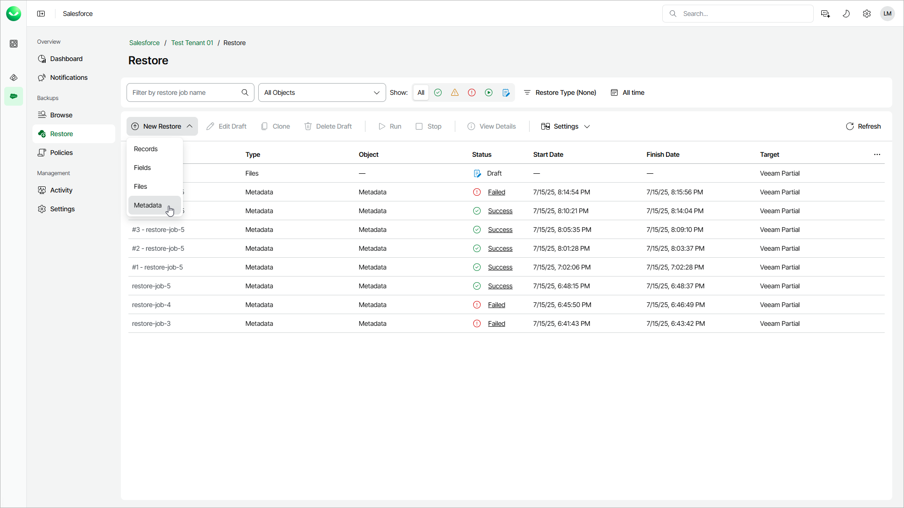

# Step 1. Launch Restore Metadata Wizard

To launch the Restore Metadata wizard:

1. On the Salesforce page, click the name of the tenant you want to manage.
2. To view all restore jobs created for the tenant, select Restore on the left.
3. Select New Restore > Metadata.

